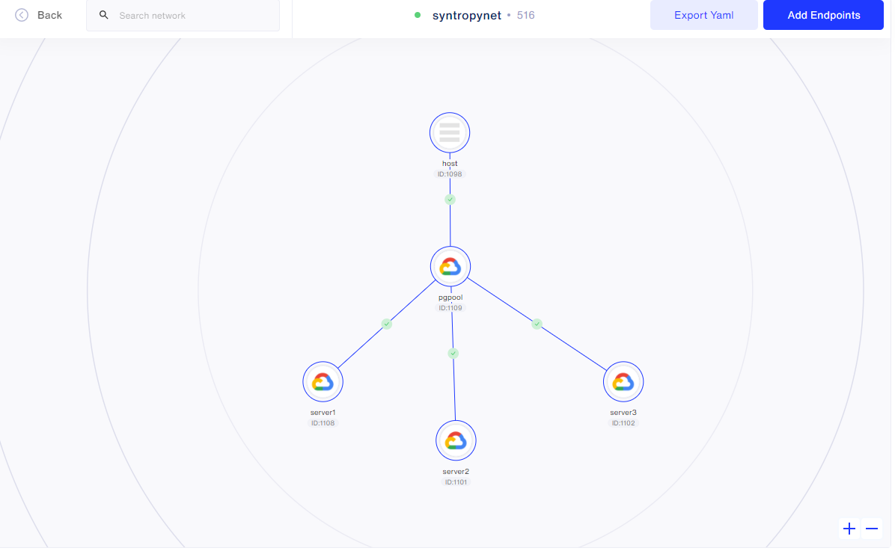

# Postgres cluster using pgpool

In this tutorial, we will create a PostgresSQL cluster (master+slaves) consisting of 1 master and 2 slave nodes nad use pgpool to proxy database connection to the client. Every component will be running on a different virtual machine.

## Requirements
- [Syntropy Stack](https://www.syntropystack.com/) account
- Python >= 3.6
- Ansible must be installed on on the host VM
- 5 virtual machines
- Generate an SSH key of the host and copy it to all the servers

## Documentation SyntropyStack

- https://docs.syntropystack.com/docs

## VM Providers 

- All VMs are based on GCP VMs

## Inventory configuration

### Configure SyntropyStack agent

Generate an API Token by logging in using the CLI:

```
syntropyctl login {syntropy stack user name} { syntropy stack password}
```

In the file `infra/inventory.ini`:
- define your `SYNTROPY_AGENT_API_KEY` -> generated via SyntropyCTL  - [SyntropyCLI](https://github.com/SyntropyNet/syntropy-cli)

### Configure VMs variables
- define your `SYNTROPY_AGENT_NAME` -> can be chosen custom
- define your `SYNTROPY_PROVIDER` -> can be chosen from [SyntropyStack docs](https://docs.syntropystack.com/docs/syntropy-agent-variables)

## Provision your Virtual Machines

- **Generate an SSH key** on your host VM and copy it to all the servers

Test Connection: 'ansible -i hosts/inventory.ini -m ping all'

Output result:
```
*.*.*.* | SUCCESS => {
    "ansible_facts": {
        "discovered_interpreter_python": "/usr/bin/python"
    }, 
    "changed": false, 
    "ping": "pong"
}
*.*.*.* | SUCCESS => {
    "ansible_facts": {
        "discovered_interpreter_python": "/usr/bin/python"
    }, 
    "changed": false, 
    "ping": "pong"
}
*.*.*.* | SUCCESS => {
    "ansible_facts": {
        "discovered_interpreter_python": "/usr/bin/python"
    }, 
    "changed": false, 
    "ping": "pong"
}
*.*.*.* | SUCCESS => {
    "ansible_facts": {
        "discovered_interpreter_python": "/usr/bin/python"
    }, 
    "changed": false, 
    "ping": "pong"
}
```

## Deploy the Syntropy agent + Services
```
ansible-playbook -i hosts/inventory.ini main.yml
```

<center></center>

<center></center>

## Connect deployed services through Syntropy Stack UI

<center></center>

**Congratulations, your Postgres cluster is up and running!**
