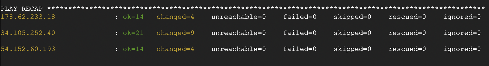
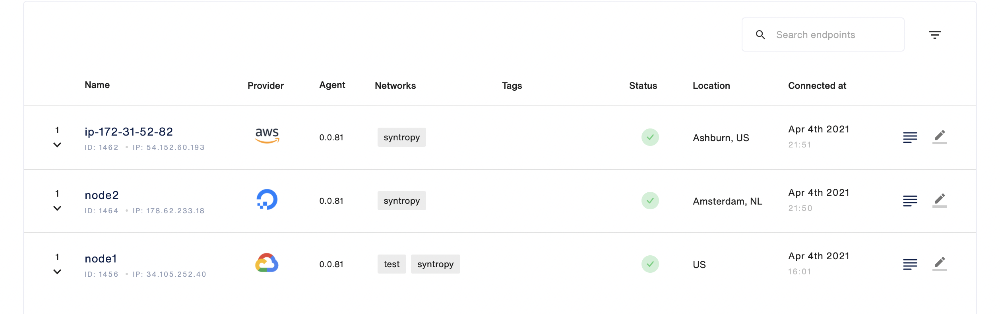
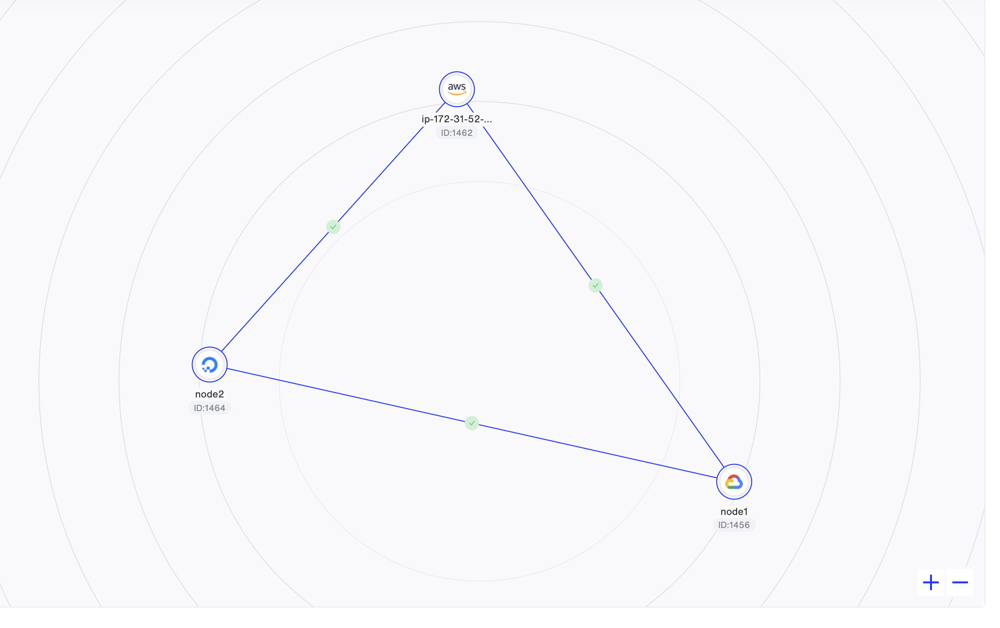
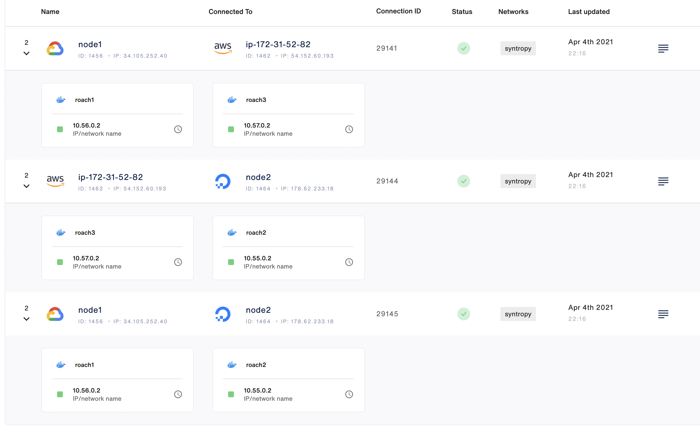
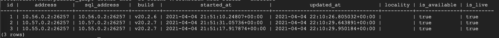

# CockroachDB cluster
This tutorial is going to demostrate how to automate the deployment of CockroachDB cluster using Ansible and Syntropy CLI consisting to three virtual machines using different cloud providers.

## Requirements
- [Syntropy Stack](https://www.syntropystack.com/) account
- Python >= 3.6
- Ansible
- 3 virtual machines on different hosts

## Ansible configuration
To begin with, provide the required details in the `secrets.yaml` file, as shown below:
```
SYNTROPY_AGENT_API_KEY: CHANGEME
SYNTROPY_NETWORK_API: "docker"
NETWORK: "host"
SYNTROPY_USERNAME: CHANGEME
SYNTROPY_PASSWORD: CHANGEME
SYNTROPY_AGENT_NAME_1: "Node-1"
SYNTROPY_PROVIDER_1: "3"
SYNTROPY_AGENT_NAME_2: "Node-2"
SYNTROPY_PROVIDER_2: "6"
SYNTROPY_AGENT_NAME_3: "Node-3"
SYNTROPY_PROVIDER_3: "1"
```

Later, access the `hosts/inventory.ini` file and provide the configuration information of your created virual machines. Note: the first node will initialize the cluster.

```
[node1]
<IP address> ansible_connection=ssh ansible_user=CHANGEME
[node2]
<IP address> ansible_connection=ssh ansible_user=CHANGEME
[node3]
<IP address> ansible_connection=ssh ansible_user=CHANGEME
```

## Check the connectivity 
When the hosts/inventory.ini the file was configured, you can check the connectivity using the command

`ansible -i hosts/inventory.ini all -m ping`

The output should look something like this:
```
34.105.252.40 | SUCCESS => {    "ansible_facts": {        "discovered_interpreter_python": "/usr/bin/python"    },     "changed": false,     "ping": "pong"}
178.62.233.18 | SUCCESS => {    "ansible_facts": {        "discovered_interpreter_python": "/usr/bin/python"    },     "changed": false,     "ping": "pong"}]
54.152.60.193 | SUCCESS => {    "ansible_facts": {        "discovered_interpreter_python": "/usr/bin/python"    },     "changed": false,     "ping": "pong"}
```

## Start the deployment
When all the necessary configuration was provided, you can run the ansible infrastructure using the following command:

`ansible-playbook -i hosts/inventory.ini main.yaml -vvv`

The following command should produce an output similar to this:



## Connecting our deployed CockroachDB cluster
The last step is to connect our deployed services using Syntropy Stack UI. But before that, check whether all your created virtual machines show up at the Endpoints section:



Then, create a new network and add all available endpoints. Also, connect every virtual machine with each other.



If connection was successfull, you will be able to connect their services as well.



##Check that cluster is up and running
To check whether all instances were connected, you could connect into any of the VM and perform a command 

```docker exec -it CONTAINER-NAME ./cockroach node status --insecure```

The output should show that all instaces are alive and available.



Congratulations! You have deployed a CockroachDB cluster using Ansible.


