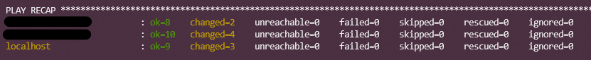
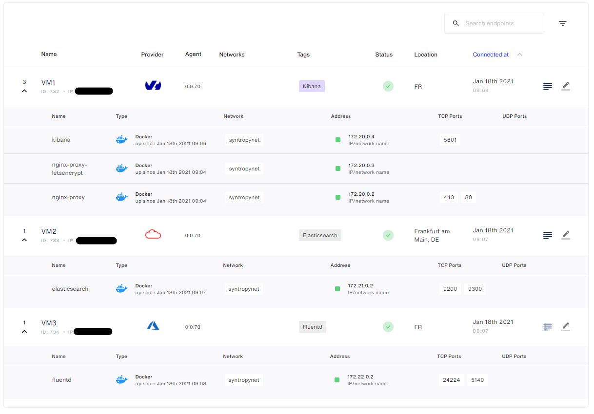
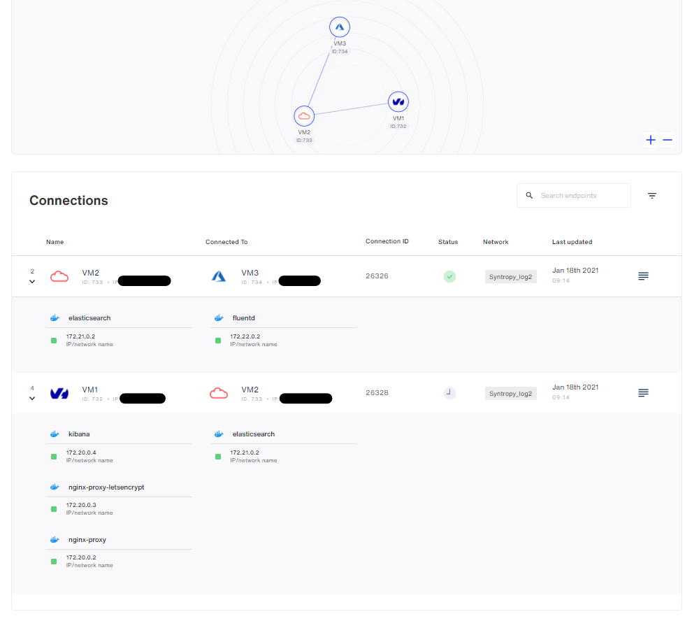
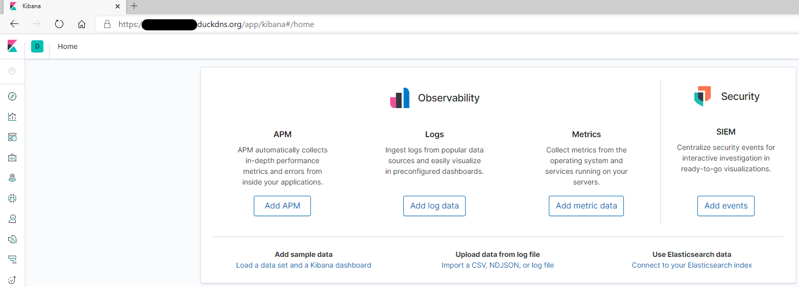
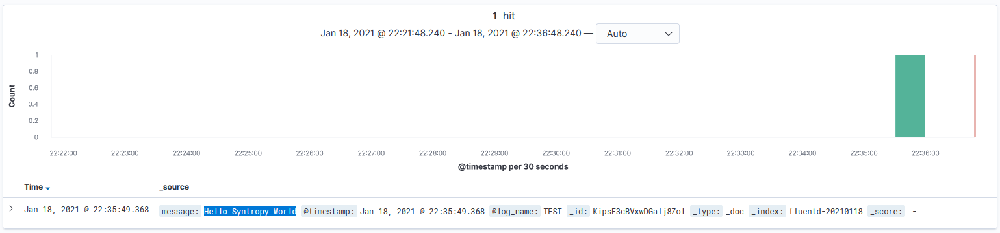

<center></center>

# Logging solution with ElasticSearch, Kibana, Fluentd and Nginx - Ansible

# Description / Requirements :

- **Syntropy Stack** account and an active Agent Token
- There must be **no ports exposed to the internet** (except Nginx 443 with SSL). Set up your firewall accordingly.
- The **subnets for the docker networks** for each of the nodes must be unique
- **Wireguard** must be installed and running on each server
- **Ansible** needs to be installed on your Control node - Localhost
- Python >= 3.6
- **Generate an SSH key** then copy it to all the servers (Ansible connection)
- **Generate an SSH key** then copy it to your GitHub account (to download it from dependencies)

# Documentation SyntropyStack

- https://docs.syntropystack.com/docs

# VM Providers

- VM1:  **Kibana + Nginx**
- VM2:  **ElasticSearch**
- VM3:  **Fluentd**

# Installation

Copy the entire **roles directory** to your controller server

Install the Syntropy Ansible Galaxy Collection.

```
ansible-galaxy collection install git@github.com:SyntropyNet/syntropy-ansible-collection.git
```

Navigate to your local ansible directory:

```
cd /root/.ansible/collections/ansible_collections/syntropynet/syntropy
```

Install the Python dependencies.

```
pip3 install -U -r requirements.txt
```

# Authentication

Generate an API Token by logging in using the CLI:

```
syntropyctl login {syntropy stack user name} { syntropy stack password}
```

In the file `secrets.yaml`:
- add your `agent_token`   -> generated via SyntropyUI - [SyntropyUI](https://docs.syntropystack.com/docs/get-your-agent-token)
- add your `api_token` -> generated via SyntropyCTL  - [SyntropyCLI](https://github.com/SyntropyNet/syntropy-cli)


# Provision your Virtual Machines

- **Generate an SSH key** then copy it to all the servers (Ansible connection)

Edit `/etc/ansible/hosts`

Info:
- For Python >= 2.7 [servers:vars] ansible_python_interpreter=/usr/bin/python3
- For Python <= 2.7 [servers:vars] ansible_python_interpreter=/usr/bin/python

```
[kibana]
yourfirstpubip ansible_python_interpreter=/usr/bin/python3

[elasticsearch]
yoursecondpubip ansible_python_interpreter=/usr/bin/python3

[fluentd]
localhost ansible_python_interpreter=/usr/bin/python3
```

Test Connection: `ansible -m ping all`

Output result:
```
localhost | SUCCESS => {
    "changed": false,
    "ping": "pong"
}
*.*.*.* | SUCCESS => {
    "changed": false,
    "ping": "pong"
}
*.*.*.* | SUCCESS => {
    "changed": false,
    "ping": "pong"
}
```

# Configure your playbooks

In this file: `deploy_agent_and_service.yaml`, change:
- `agent_provider` in each of the service's playbook to match each server's cloud provider, a reference to the providers can be found [here](https://docs.syntropystack.com/docs/syntropy-agent-variables).
- `domain_dns` <-- For your SSL connection
- `Email`

# Deploy Agent / Services / Network

Deploy the Syntropy Agent + Services:
```
ansible-playbook deploy_agent_and_service.yaml
```

<center></center>

<center></center>


Deploy the Network:
```
ansible-playbook deploy_network.yaml
```

<center></center>


# Kibana

- Connect to https://DomainDNS address

<center></center>


- Simulate a log with `curl` command:

`curl -X POST -d 'json={"message":"Hello Syntropy World"}' 172.22.0.2:9880/TEST`

<center></center>


**Congratulations, your architecture is up and running ;-)**
