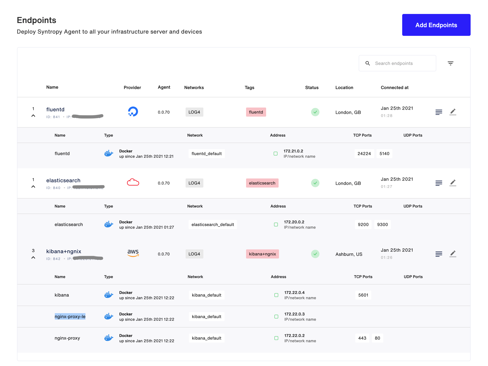

# Logging solution with Elasticsearch, Fluentd, Kibana and Nginx

Create a logging network with minimum 3 nodes (preferably on different providers) with FluentD, ElasticSearch, Kibana and Nginx (with Let’s Encrypt SSL certificates and Basic Auth enabled) using SyntropyStack
command-line tool (network are defined in YAML files)

## Requirements:

- There must be no ports exposed to the internet (except Nginx 443 with SSL). You can't use -p flag.
- All services must run in Docker containers.
- All connections between services must be created using Syntropystack.
- You must create a Docker network (name: syntropynet) on each node and assign subnets, which can’t overlap.
- All services must run in syntropynet Docker network.

## To start, build 3x VM from 3x different providers

- First VM:   __Elasticsearch__
- Second VM:  __Nginx + Kibana__
- Third VM:   __Fluentd__

## Install wireguard

Wireguard installation: https://www.wireguard.com/install

## Prepare agent

Every service is installed with separate syntropystack agent(docker service). You can find it from docker-compose files. There are some `SYNTROPY_` environment variables that you need to fill before running agents.
Please check [syntropystack documentation](https://docs.syntropystack.com/docs).

## Install DuckDns

We use [DuckDns](https://duckdns.org) which is a free dynamic DNS service that allows you to point a subdomain under duckdns.org at your computer.

## Run services

If wireguard is running and syntropystack agent is configured then you are ready to run services.

#### Elasticsearch

* Copy elasticsearch folder to the first VM.
* Run `docker-compose up -d`

#### Kibana+Nginx

* Copy kibana folder to the second VM. 
* Configure `docker-compose.yml` to use DuckDns url. 
* Rename file `/auth/VIRTUAL_HOST`(basic auth) to DuckDns domain
* Run `docker-compose up -d`

#### Fluentd

* Copy fluentd folder to the third VM.
* Run `docker-compose up -d`

# Confirm your endpoints

You should see all the endpoints in Syntropy UI.



# Install Syntropy CLI

Documentation can be found [here](https://docs.syntropystack.com/docs/syntropyctl).

Install the Syntropy CLI.

```
pip3 install syntropycli
```

Install Syntropy NAC.

```
pip3 install syntropynac
```

# Authentication

Next, we need to generate an API Token (not to be confused with your Agent Token). To generate an API Token, install the [Syntropy CLI](https://github.com/SyntropyNet/syntropy-cli).

Before accessing commands, set the following environment variables(for example via your `.bashrc` file):
```
export SYNTROPY_API_SERVER=https://controller-prod-server.syntropystack.com
```

Generate an API Token by logging in using the CLI:

```
syntropyctl login {syntropy stack user name} { syntropy stack password}
```

Copy the API token and add it to your ENV. You'll need to add the API URL, as well as your username in password.

```
export SYNTROPY_API_TOKEN="your_syntropy_api_token"
```

Now we're ready to use the CLI.

# Create your network

Check that your endpoints are available. SyntropyCTL (Computational Topology Library) is a command line utility that installed as part of the CLI.

```
syntropyctl get-endpoints
```

You should see your endpoints show up in a table like the one shown below.

```
+----------+---------------+----------------+---------------------+----------+--------+---------------+
| Agent ID |      Name     |   Public IP    |       Provider      | Location | Online |      Tags     |
+----------+---------------+----------------+---------------------+----------+--------+---------------+
|   841    |    fluentd    | *.*.*.*        |     DigitalOcean    |  London  |  True  |    fluentd    |
|   842    |  kibana+ngnix | *.*.*.*        | Amazon Web Services | Ashburn  |  True  |  kibana+ngnix |
|   840    | elasticsearch | *.*.*.*        |     Oracle Cloud    |  London  |  True  | elasticsearch |
+----------+---------------+----------------+---------------------+----------+--------+---------------+
```

Next we'll use the Syntropy NAC (Network As Code) command line utility in conjunction with the network template defined in `networks/LOG4.yaml`. You can first perform a dry run using the `--dry-run` flag.

```
syntropynac configure-networks --dry-run networks/LOG4.yaml
```

Which outputs.

```
Configuring network LOG4 
Created network LOG4 with id 403
Created 2 connections for network LOG4
Configured 2 connections and 6 subnets for network LOG4
Done
```

Next, create the network. The NAC utility will automatically enable your connection between services.

```
syntropynac configure-networks networks/LOG4.yaml
```

The result looks like:

```
Configuring network LOG4 
Created network LOG4 with id 403
Created 2 connections for network LOG4
Configured 2 connections and 6 subnets for network LOG4
Done
```

You can view your newly created network in the Syntropy UI.

__Congratulations, your architecture is up and running ;-)__
