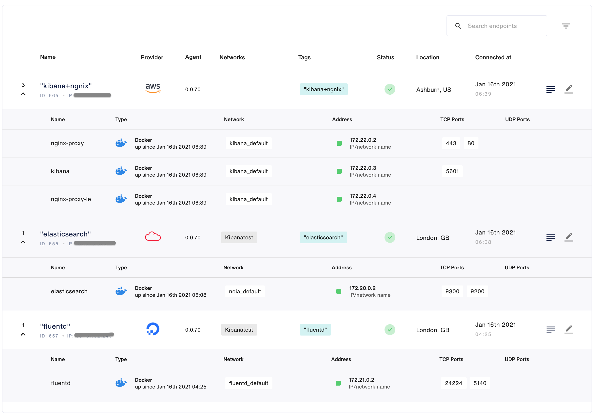
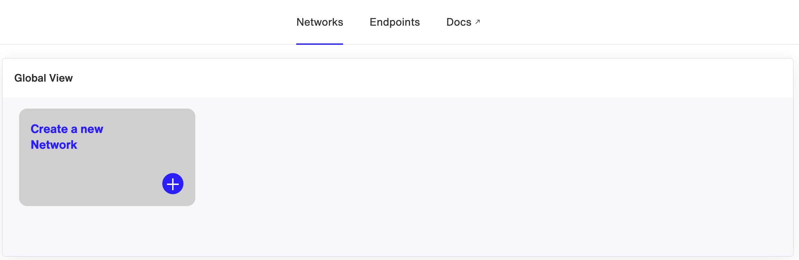
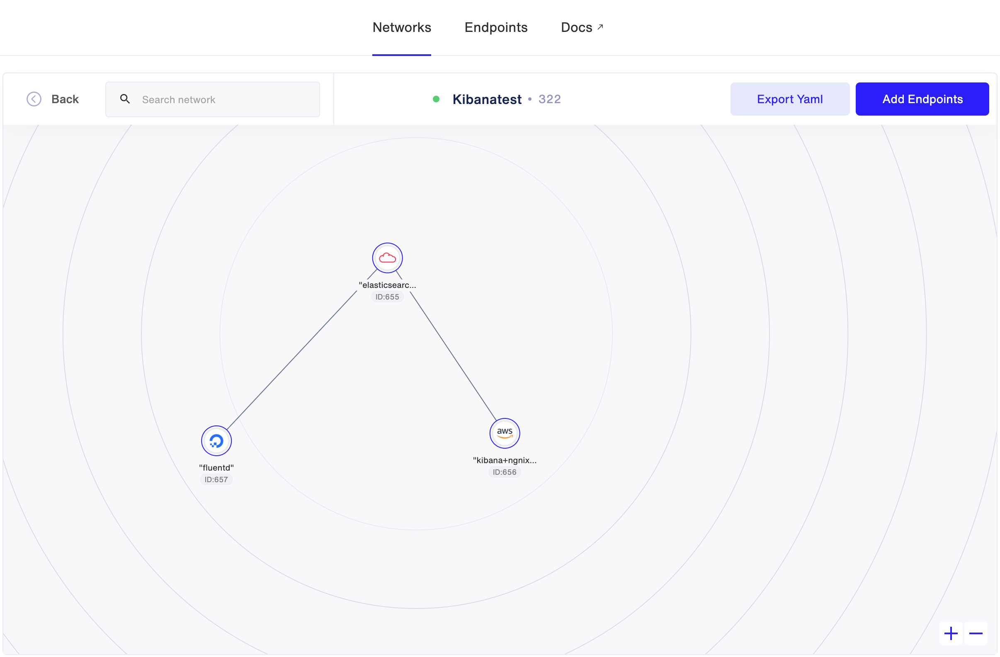
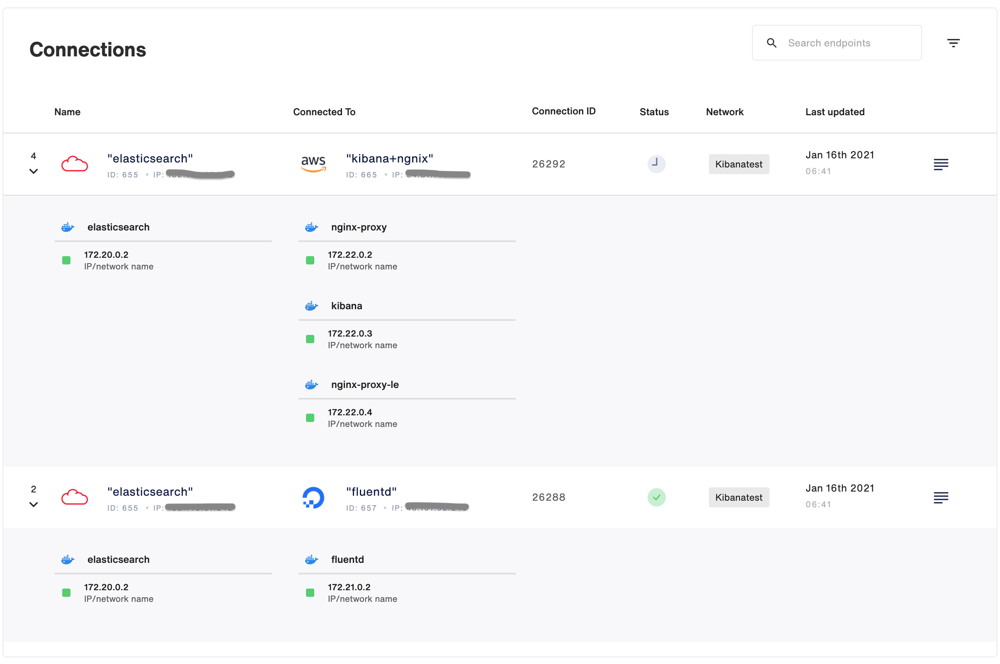
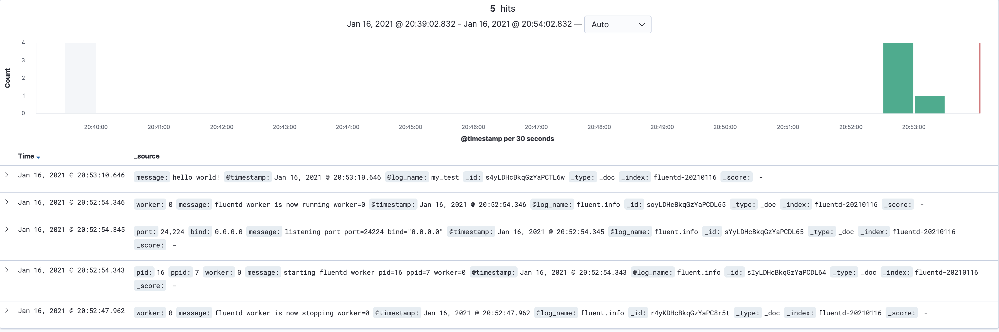

# Logging solution with Elasticsearch, Fluentd, Kibana and Nginx

Create a logging network with minimum 3 nodes (preferably on different providers) with FluentD, ElasticSearch, Kibana and Nginx (with Let’s Encrypt SSL certificates and Basic Auth enabled).

## Requirements:

- There must be no ports exposed to the internet (except Nginx 443 with SSL). You can't use -p flag.
- All services must run in Docker containers.
- All connections between services must be created using Syntropystack.
- You must create a Docker network (name: syntropynet) on each node and assign subnets, which can’t overlap.
- All services must run in syntropynet Docker network.

## To start, build 3x VM from 3x different providers

- First VM:   __Elasticsearch__
- Second VM:  __Nginx + Kibana__
- Third VM:   __Fluentd__

## Install wireguard

Wireguard installation: https://www.wireguard.com/install

## Prepare agent

Every service is installed with separate syntropystack agent(docker service). You can find it from docker-compose files. There are some `SYNTROPY_` environment variables that you need to fill before running agents.
Please check [syntropystack documentation](https://docs.syntropystack.com/docs).

## Run services

If wireguard is running and syntropystack agent is configured then you are ready to run services.

#### Elasticsearch

* Copy elasticsearch folder to the first VM.
* Run `docker-compose up -d`

#### Kibana+Nginx

* Copy kibana folder to the second VM.
* Run `docker-compose up -d`

#### Fluentd

* Copy fluentd folder to the third VM.
* Run `docker-compose up -d`

## Add endpoints

## Create your Network

## Interconnect services

## Testing

- Connect to https://DuckerDNSDomain address and login(credentials: user/pass)

- Send test data from fluentd VM. Run command: `curl -X POST -d 'json={"message":"hello world!"}' 172.21.0.2:9880/my_test`

- Check received data in Kibana VM

__Congratulations, your architecture is up and running ;-)__

