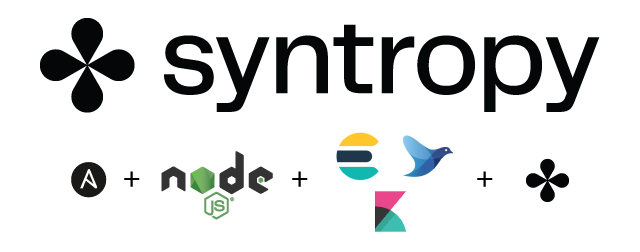
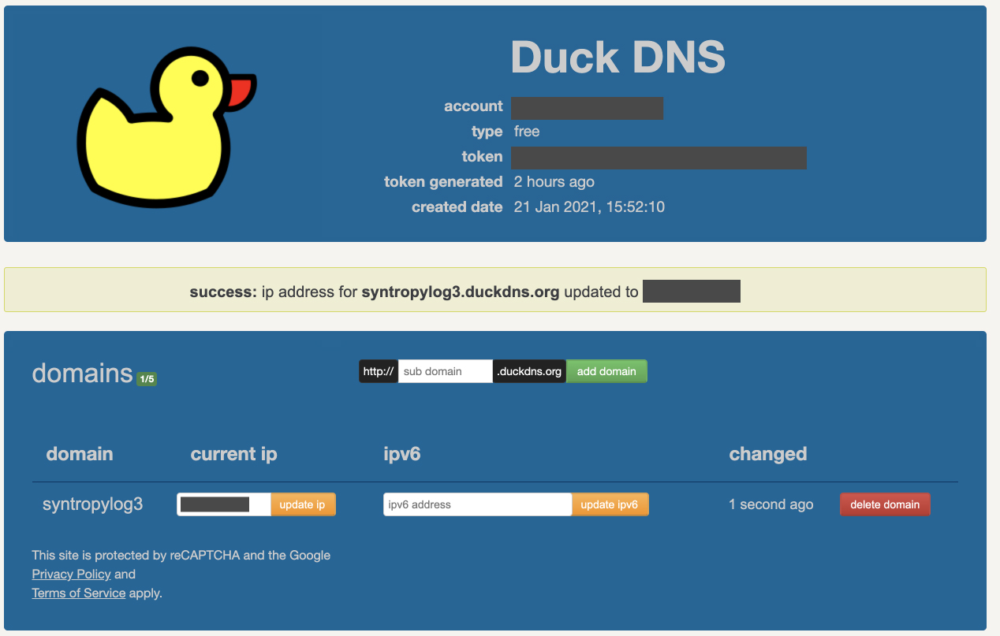
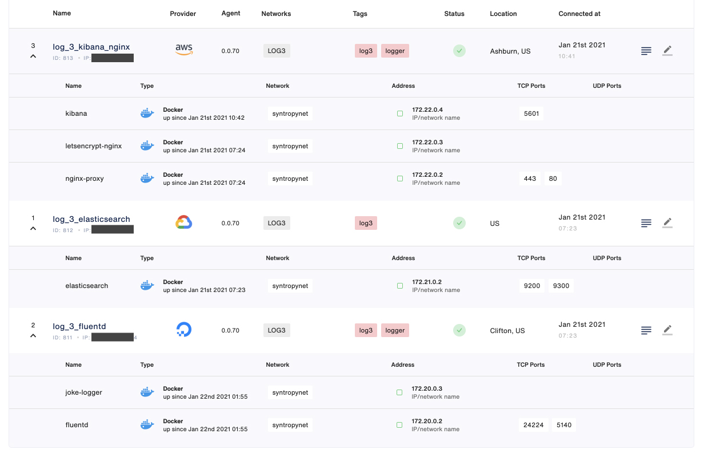
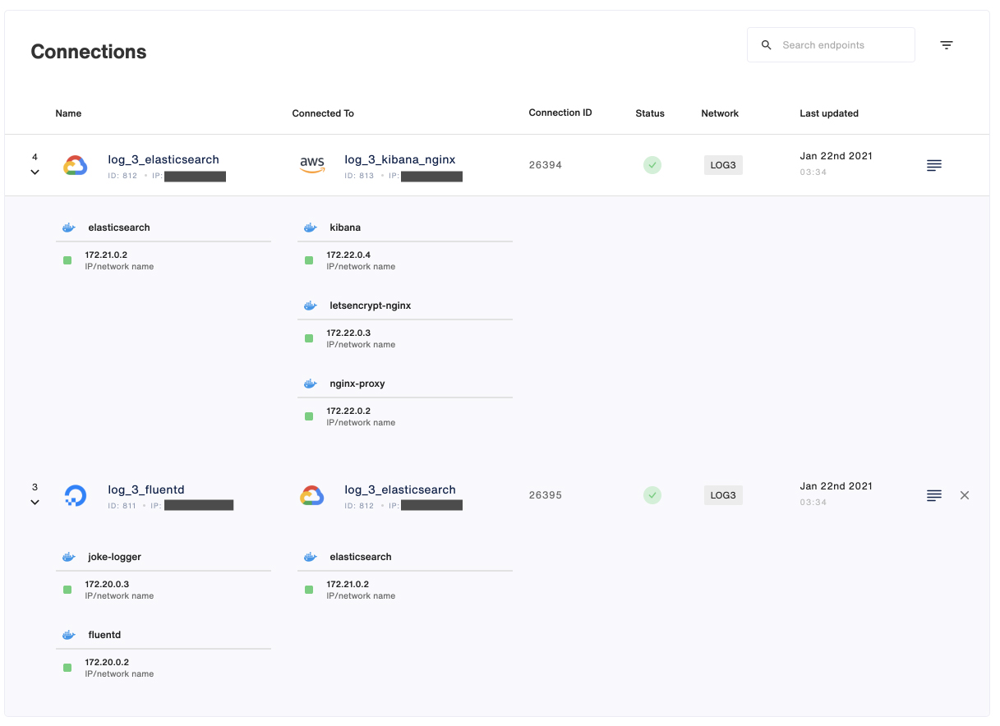
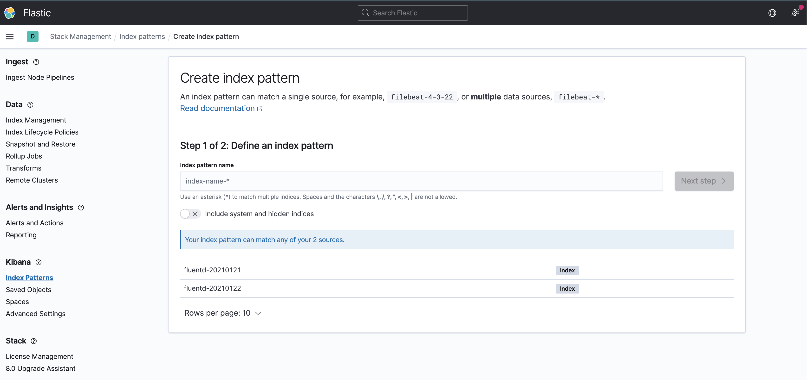
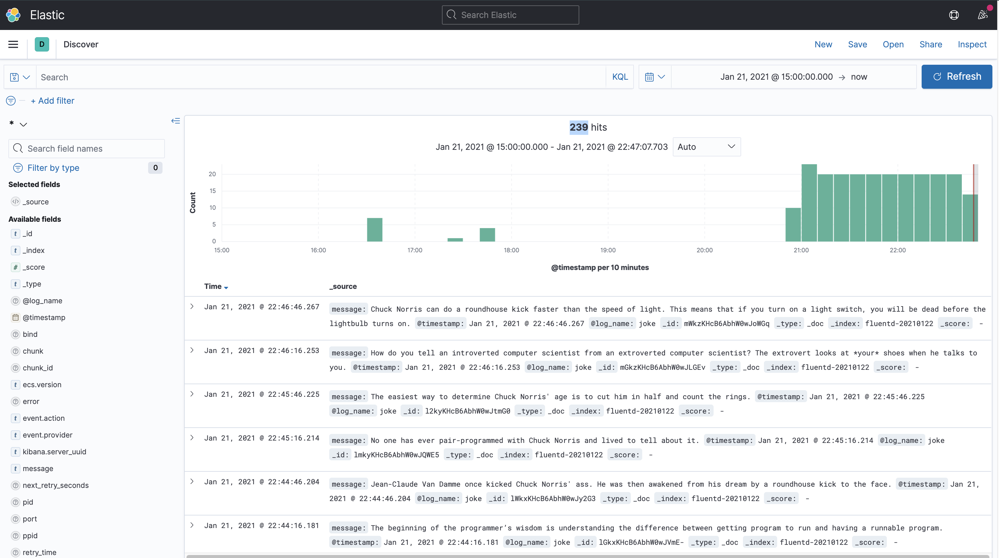

<p align="center">

</p>

This example describes how to use the **Syntropy Stack** to create an EFK (Elasicsearch, FluentD, and Kibana) logging network that spans three separate VMs spread across different cloud providers. [FluentD](https://www.fluentd.org) serves as a unified logging layer, while [ElasticSearch](https://www.elastic.co) provides an interface for searching through the logs. [Kibana](https://www.elastic.co/kibana), sitting behind an [Nginx](https://www.nginx.com) proxy, serves a dashboard over HTTPS for visualizing our log data. Each service will be created using an Ansible playbook and the Syntropy network will be created using the Syntropy NAC (Network As Code) command line utility. A NodeJS App runs as a service to send log output to FluentD.

```
┌ ─ ─ ─ ─ ─ ─ ─ ─ ─ ─ ─ ─ ─ ─ ─ ─ ─ ─ ─ ─ ─ ─ ─ ─ ─ ─ ─ ─ ─ ─
        VM 1                                                 │
│      ┌ ─ ─ ─ ─ ─ ─ ─ ─ ─ ─ ─ ─ ─ ─ ─ ─ ─ ─ ─ ─ ─ ─ ─
                        172.20.0.0/24                 │      │
│      │
                                                      │      │
│      │ ┌────────────────┐      ┌───────────── 24224
         │     NodeJS     │─────▶│    FluentD   5140  │      │
│      │ └────────────────┘      └────────────────┘
                                                      │      │
│      │              ┌────────────────┐
                      │    Syntropy    │              │      │
│      │              │     Agent      │
                      └────────────────┘              │      │
│      │
        ─ ─ ─ ─ ─ ─ ─ ─ ─ ─ ─ ─ ─ ─ ─ ─ ─ ─ ─ ─ ─ ─ ─ ┘      │
│                              │
                               │                             │
│                              │
                               │                             │
│                              │
                  VM 2         ▼                             │
│                 ┌ ─ ─ ─ ─ ─ ─ ─ ─ ─ ─ ─ ─
                        172.21.0.0/24      │                 │
│                 │
                      ┌────────────────┐   │                 │
│                 │   │ ElasticSearch 9200
                      │               9300 │                 │
│                 │   └────────────────┘
                                           │                 │
│                 │   ┌────────────────┐
                      │    Syntropy    │   │                 │
│                 │   │     Agent      │
                      └────────────────┘   │                 │
│                 │
                   ─ ─ ─ ─ ─ ─ ─ ─ ─ ─ ─ ─ ┘                 │
│                              ▲
                               │                             │
│                              │
                               │                             │
│                              │
                  VM 3         │                             │
│                              │
                  ┌ ─ ─ ─ ─ ─ ─ ─ ─ ─ ─ ─ ─                  │
│                       172.22.0.0/24      │
                  │                                          │
│                     ┌────────────────┐   │                                ┌───────────────┐
                  │   │    Syntropy    │                     │              │               │
│                     │     Agent      │   │                     ┌──────────│    Client     │
                  │   └────────────────┘                     │   │          │               │
│                     ┌────────────────┐   │                     │          └───────────────┘
                  │   │     Kibana    5601                   │   │
│                     └────────────────┘   │                     │
                  │   ┌────────────────┐                     │   │
│                     │  Letsencrypt   │   │                     │
                  │   └────────────────┘                     │   │
│                     ┌────────────────┐   │                     │
                  │   │     Nginx     443   ◀────────────────┼───┘
│                     └────────────────┘   │
                  └ ─ ─ ─ ─ ─ ─ ─ ─ ─ ─ ─ ─                  │
│
  SYNTROPY NETWORK                                           │
└ ─ ─ ─ ─ ─ ─ ─ ─ ─ ─ ─ ─ ─ ─ ─ ─ ─ ─ ─ ─ ─ ─ ─ ─ ─ ─ ─ ─ ─ ─
```

# Requirements

- A [Syntropy Stack](https://syntropystack.com) account and an active Agent Token
- There must be no ports exposed to the internet (except Nginx 443 with SSL)
- All services must run in Docker containers.
- All connections between services must be created using Syntropy Stack.
- Each endpoint must be on a unique subnet.
- Ansible needs to be installed on your Control node (your local machine or whatever machine you will run the playbooks on)
- Python >= 3.6

# Authentication


Install the Syntropy CLI. Docs can be found [here](https://docs.syntropystack.com/docs/syntropy-ctl-installation).

```
pip3 install syntropycli
```

Rename the `sample.secrets.yaml` file to `secrets.yaml` and add your Agent Token (generated via Syntropy UI) to the `api_key` variable.

Next, we need to generate an API Token (not to be confused with your Agent Token). To generate an API Token, install the [Syntropy CLI](https://github.com/SyntropyNet/syntropy-cli).

Generate an API Token by logging in using the CLI:

```
syntropyctl login {syntropy stack user name} { syntropy stack password}
```

Copy the API token and add it to your ENV, for example via your `.bashrc` file. You'll need to add the API URL, as well as your username in password.

```
export SYNTROPY_API_SERVER=https://controller-prod-server.syntropystack.com
export SYNTROPY_API_TOKEN="your_syntropy_api_token"
export SYNTROPY_PASSWORD="your_syntropy_password"
export SYNTROPY_USERNAME="your_syntropy_username"
```

# Installation


Install Syntropy NAC.

```
pip3 install syntropynac
```

Install the Syntropy Ansible Galaxy Collection.

```
ansible-galaxy collection install git@github.com:SyntropyNet/syntropy-ansible-collection.git
```

Navigate to your local ansible directory, for example on Mac OS:

```
cd /Users/{user}/.ansible/collections/ansible_collections/syntropynet/syntropy
```

Install the Python dependencies.

```
pip3 install -U -r requirements.txt
```


# Provision your Virtual Machines

You can do this manually, but the `provision_hosts.yaml` Ansible playbook has been provided for convenience. Update the `syntropyhosts` file to include configuration for your hosts.

`ansible_ssh_private_key_file`: if any of your VMs require a `.pem` file for SSH access, include the file's location here.

`ansible_host`: VM's IP public IP address

`ansible_user`: Your host's SSH user

Ensure that you have access to your VMs via SSH and that they've been added to your list of authorized keys so that Ansible has access to the VMS.

Each VM requires Docker, Wireguard, along with their python dependencies to be installed. This can be done using the `provision_hosts.yaml` playbook.

`ansible-playbook provision_hosts.yaml -i syntropyhosts -vv`

# Customize your playbooks

Change the `agent_provider` for each service's play (inside the `deploy_services.yaml` playbook) to match each server's cloud provider, a reference to the providers can be found [here](https://docs.syntropystack.com/docs/syntropy-agent-variables).

Eg.

```
deploy_services.yaml

---
# Deploy Elastic Search
- name: Deploy ElasticSearch
  hosts: elasticsearch
  vars:
    agent_name: "log_3_elasticsearch"
    agent_tags: "log3"
    agent_provider: "3" # <=== replace this
    network_name: "syntropynet"
    service_name: "elasticsearch"
    subnet: 172.21.0.0/24
  roles:
    - create_docker_network
    - launch_syntropy_agent
    - launch_elasticsearch

...
```

# Prepare the Nginx proxy

Before you can configure the proxy playbook you need to configure your DNS and set your `htpasswd` credentials.

For this example, we'll use [DuckDNS](https://www.duckdns.org/). DuckDNS is a free service that will allow you to point a DNS ( a subdomain of your choosing for `duckdns.org`) to an IP address of your choice, ie. your VM hosting Kibana. The easiest way to get access is to sign in using your Google / Reddit / Github Twitter account.



Create a subdomain, for example `syntropylog3` and update your current IP using your `kibana-nginx` VM's public IP address. Next, add your subdomain to the `secrets.yaml` file.

```
duck_dns_domain: "syntropylog3.duckdns.org"
```

We want basic authentication in place to restrict access to the Kibana instance, so we need to generate credentials using `htpasswd`. You can create your credentials at: https://www.web2generators.com/apache-tools/htpasswd-generator

Set your `Username` and `Password`, then generate the `.htpasswd` file. Copy the contents of the file and place it in the `secrets.yaml` file along with your username and password.

```
htpasswd_user: "" #
htpasswd_password: ""
htpasswd_credentials: "" # the contents of the .htpasswd file
```

You'll use the username and password when accessing Kibana through the browser.

Lastly, we use [letsencrypt-nginx-proxy-companion](https://github.com/nginx-proxy/docker-letsencrypt-nginx-proxy-companion) to handle the SSL certificate and redirect traffic on port 80 to port 443. Add your email address to the `secrets.yaml` file.

```
letsencrypt_email: "" # your email address to attach to your letsencrypt cert
```

# Deploy services

Deploy the Services:

```
ansible-playbook deploy_services.yaml -i syntropyhosts -vv
```

You can check that the endpoints are correctly configured using the Syntropy CTL (Computational Topology Library) command line utility:

```
syntropyctl get-endpoints
```

Your output should look something like this:

```
+----------+---------------------+----------------+-----------------------+----------+--------+--------------+
| Agent ID |         Name        |   Public IP    |        Provider       | Location | Online |     Tags     |
+----------+---------------------+----------------+-----------------------+----------+--------+--------------+
|   812    | log_3_elasticsearch |     *.*.*.*    | Google Cloud Platform |          |  True  |     log3     |
|   813    |  log_3_kibana_nginx |     *.*.*.*    |  Amazon Web Services  | Ashburn  |  True  | log3, logger |
|   811    |    log_3_fluentd    |     *.*.*.*    |      DigitalOcean     | Clifton  |  True  | log3, logger |
+----------+---------------------+----------------+-----------------------+----------+--------+--------------+
```

You can also view your Endpoints using Syntropy UI.



# Create the network

Use the Syntropy NAC (Network As Code) command line utility to create the network using the template located at `networks/LOG3.yml`.

`syntropynac configure-networks networks/LOG3.yml`

The above command will output the following:

```
Configuring network LOG3
Created network LOG3 with id 379
Created 2 connections for network LOG3
Configured 2 connections and 7 subnets for network LOG3
Done
```

Confirm the network is online using:

```
$ syntropyctl get-networks -j

[
    {
        "network_id": 379,
        "organization_id": null,
        "user_id": 294,
        "agent_gateway_id": null,
        "network_key": "QWoP7HWfc9ujOVhiK90ZAyXctkoKJ4tW",
        "network_type": "POINT_TO_POINT",
        "network_name": "LOG3",
        "network_disable_sdn_connections": true,
        "network_created_at": "2021-01-22T03:34:34.562",
        "network_updated_at": "2021-01-22T03:34:36.100",
        "network_metadata": {
            "network_created_by": "CONFIG",
            "network_type": "P2M",
            "network_updated_by": "CONFIG"
        }
    }
]
```

Or check the connections via Syntropy UI.



# View logs using Kibana

The `joke-logger` service running on the `log_3_fluentd` endpoint is a simple NodeJS app that fetches a joke from an API endpoint and sends it to FluentD in a POST request on a 30s interval.

You can also simulate a logging event yourself using `curl`, specifying the `@log_name` as a path parameter in the FluentD URL. SSH into any of your VMs and execute the following curl:

```
curl -X POST -d 'json={"message":"this is a test"}' 172.20.0.2:9880/test_log_name
```

To view the Kibana log dashboard, open your browser and navigate to `https://<your_subdomain>.duckdns.org` and login using the credentials used to create your `.htpasswd` earlier.

Under `Management > Stack Management > Index Patterns > Create index pattern`, you'll want to confirm you see your `fluentd` service recognized as an index pattern.



Once you've confirmed the index pattern is available, head to `Kibana > Discover` and ensure your time/date filter is filtered to `-> now`. You should see your logs appear. If not, try hitting `Refresh`.



**Congratulations, your architecture is up and running ;-)**
