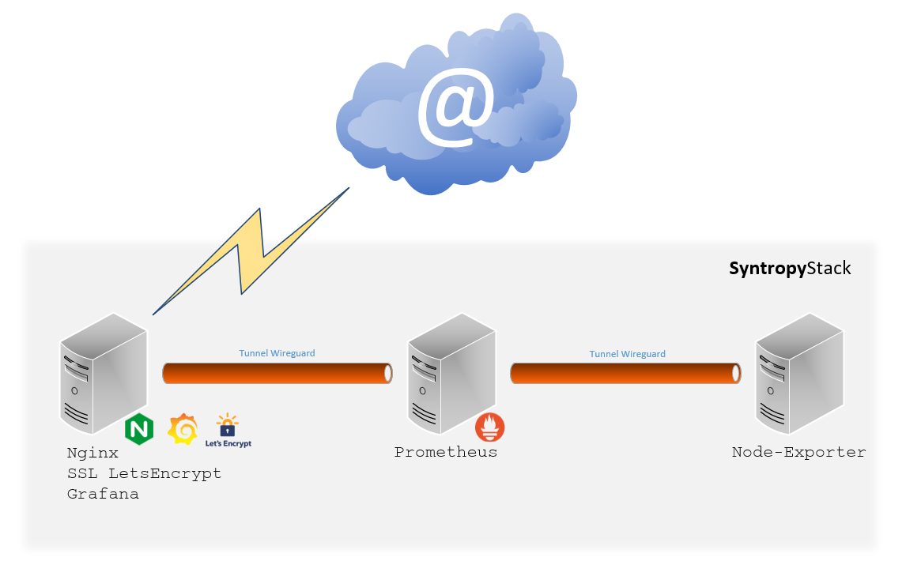
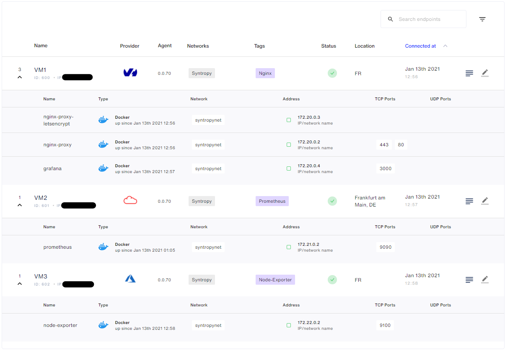
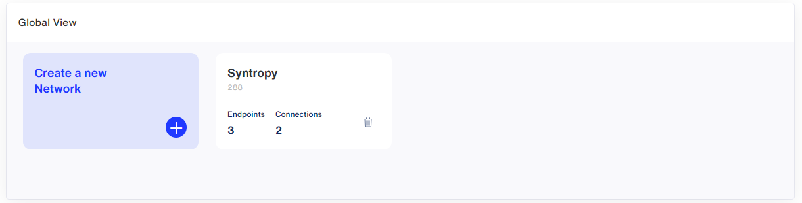
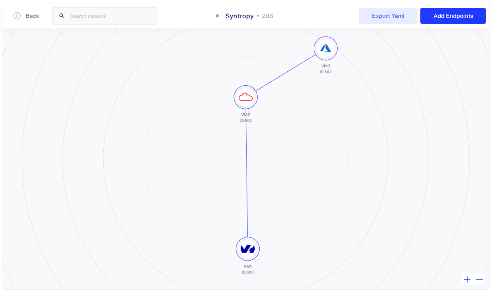
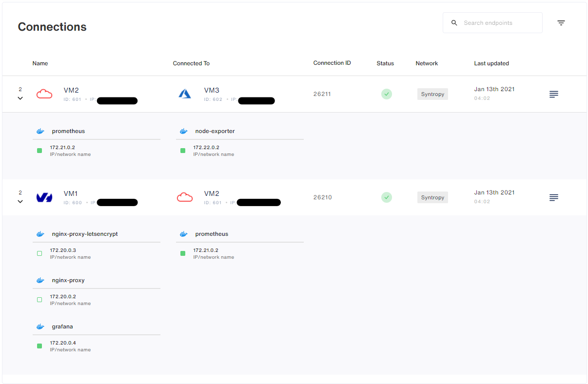
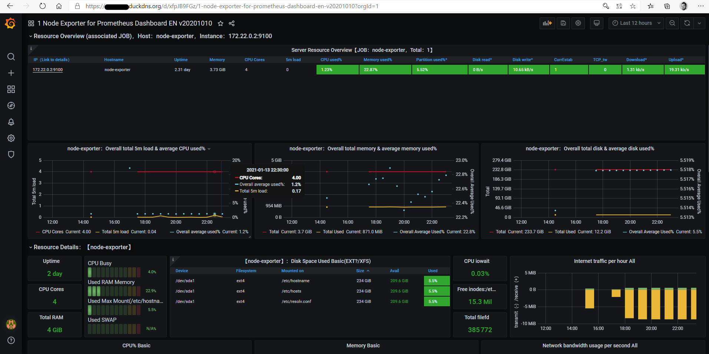

<center></center>

# Monitoring solution with Grafana, Prometheus, node_exporter and Nginx - ansible

<center></center>

# Description / Requirements :

- **Syntropy Stack** account and an active Agent Token
- There must be **no ports exposed to the internet** (except Nginx 443 with SSL). Set up your firewall accordingly.
- The **subnets for the docker networks** for each of the nodes must be unique
- **Wireguard** must be installed and running on each server
- **Ansible** needs to be installed on your Control node - Localhost
- Python >= 3.6
- **Generate an SSH key** then copy it to all the servers (Ansible connection)
- **Generate an SSH key** then copy it to your GitHub account (to download it from dependencies)

# Documentation SyntropyStack

- https://docs.syntropystack.com/docs

# Build 3x VM from 3x different providers (preferably)

- VM1:  **Nginx + Grafana**
- VM2:  **Prometheus**
- VM3:  **Node-Exporter**

# Installation

Copy the entire **roles directory** to your controller server

Install the Syntropy Ansible Galaxy Collection.

```
ansible-galaxy collection install git@github.com:SyntropyNet/syntropy-ansible-collection.git
```

Navigate to your local ansible directory:

```
cd /root/.ansible/collections/ansible_collections/syntropynet/syntropy
```

Install the Python dependencies.

```
pip3 install -U -r requirements.txt
```

# Authentication

Generate an API Token by logging in using the CLI:

```
syntropyctl login {syntropy stack user name} { syntropy stack password}
```

In the file `secrets.yaml`:
- add your `api_key`   -> generated via Syntropy UI) - [Syntropy UI](https://docs.syntropystack.com/docs/get-your-agent-token)
- add your `api_token` -> generated via Syntropyctl  - [Syntropy CLI](https://github.com/SyntropyNet/syntropy-cli)


# Create the file "prometheus.yml" on VM2 - Prometheus

```
      global:
        scrape_interval: 5s
        external_labels:
          monitor: 'node'
      scrape_configs:
        - job_name: 'prometheus'
          static_configs:
            - targets: ['DOCKER_IP_PROMETHEUS:9090']
        - job_name: 'node-exporter'
          static_configs:
            - targets: ['DOCKER_IP_EXPORTER:9100']
```


# Provision your Virtual Machines

- **Generate an SSH key** then copy it to all the servers (Ansible connection)

Edit `/etc/ansible/hosts`

Info:
For Python >= 2.7 [servers:vars] ansible_python_interpreter=/usr/bin/python3
For Python <= 2.7 [servers:vars] ansible_python_interpreter=/usr/bin/python

```
[nginx]
yourfirstpubip ansible_python_interpreter=/usr/bin/python3

[prometheus]
yoursecondpubip ansible_python_interpreter=/usr/bin/python3

[node-exporter]
localhost ansible_python_interpreter=/usr/bin/python3
```

Test Connection: `ansible -m ping all`

Output result:
```
localhost | SUCCESS => {
    "changed": false,
    "ping": "pong"
}
*.*.*.* | SUCCESS => {
    "changed": false,
    "ping": "pong"
}
*.*.*.* | SUCCESS => {
    "changed": false,
    "ping": "pong"
}
```

# Configure your playbooks

In this file: `deploy_agent_and_service.yaml`, change:
- `agent_provider` in each of the service's playbook to match each server's cloud provider, a reference to the providers can be found [here](https://docs.syntropystack.com/docs/syntropy-agent-variables).
- `domain_dns` <-- For your SSL connection
- `Email`
- `login_grafana` <-- Access to Grafana UI
- `pass_grafana`


# Deploy Agent / Services / Network

Deploy the Syntropy Agent + Services:
```
ansible-playbook deploy_agent_and_service.yaml
```
<center></center>


Deploy the Network:
```
ansible-playbook deploy_network.yaml
```
<center></center>
<center></center>
<center></center>


# Node_Exporter <-> Prometheus

Change value on file `prometheus.yml`:
```
- targets: ['DOCKER_IP_PROMETHEUS:9090']
- targets: ['DOCKER_IP_EXPORTER:9100']
```


## Configuration Grafana

- Connect to https://DomainDNS address + Add DataSource Prometheus and identify DOCKER_IP_PROMETHEUS

- Import (Create > Import) this Dashboard: https://grafana.com/grafana/dashboards/11074

<center></center>


**Congratulations, your architecture is up and running ;-)**
