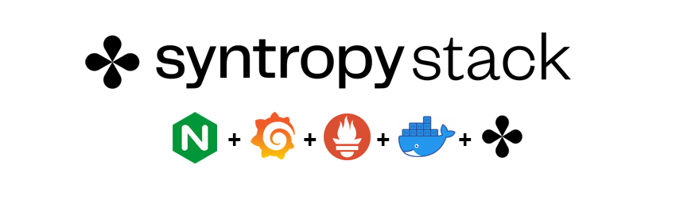
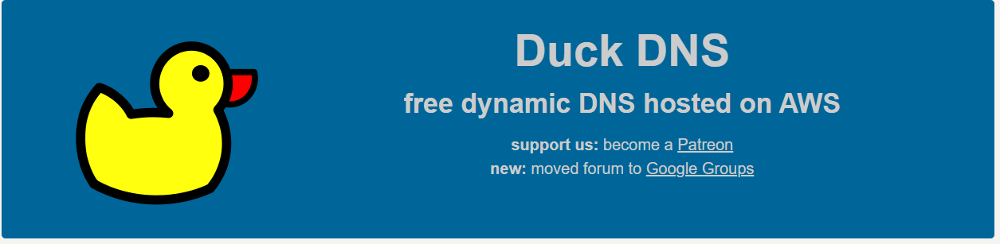
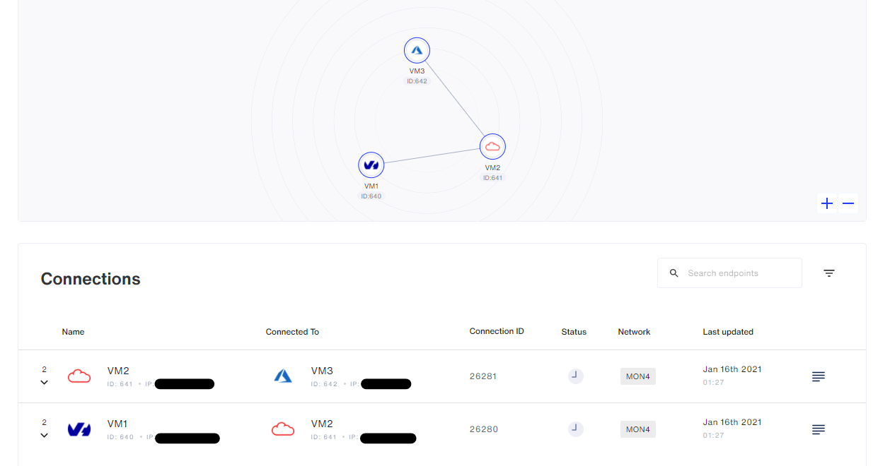

<center></center>

# Monitoring solution with Grafana, Prometheus, node_exporter and Nginx

Description / Requirements :

- Create a monitoring network with minimum 3 nodes (preferably on different providers) with node_exporter, Prometheus, Grafana and Nginx (with Let’s Encrypt SSL certificates).
- There must be __no ports exposed to the internet__ (except Nginx 443 with SSL). Set up your firewall accordingly.

## To start, build 3x VM from 3x different providers (preferably)

- First VM:   __Nginx + Grafana__
- Second VM:  __Prometheus__
- Third VM:   __Node-Exporter__

## Start Syntropy Agent on every VM with this command (generate a token/api key on the platform https://platform.syntropystack.com ):

```
sudo docker run --network="host" --restart=on-failure:10 --cap-add=NET_ADMIN --cap-add=SYS_MODULE \
-v /var/run/docker.sock:/var/run/docker.sock:ro \
--device /dev/net/tun:/dev/net/tun --name=syntropynet-agent \
-e SYNTROPY_API_KEY=CHANGE ME \
-e SYNTROPY_TAGS=CHANGE ME \
-e SYNTROPY_PROVIDER=CHANGE ME \
-e SYNTROPY_AGENT_NAME=CHANGE ME \
-e SYNTROPY_NETWORK_API='docker' \
-d syntropynet/agent:stable
```

## Launch services on each dedicated VM. Be careful by launching them on a different subnet:

First VM:

```
sudo docker network create --subnet 172.20.0.0/24 syntropynet
```

Second VM:

```
sudo docker network create --subnet 172.21.0.0/24 syntropynet
```

Third VM:

```
sudo docker network create --subnet 172.22.0.0/24 syntropynet
```

## First VM (replace dedicated fields):

- Create Domain on DuckDNS - https://www.duckdns.org/ and redirect on your Public IP

<center></center>

- Launch docker

```
sudo docker run --detach --net=syntropynet \
--name nginx-proxy \
--publish 80:80 \
--publish 443:443 \
--volume /etc/nginx/certs \
--volume /etc/nginx/vhost.d \
--volume /usr/share/nginx/html \
--volume /var/run/docker.sock:/tmp/docker.sock:ro \
jwilder/nginx-proxy
```

```
sudo docker run --detach --net=syntropynet \
--name nginx-proxy-letsencrypt \
--volumes-from nginx-proxy \
--volume /var/run/docker.sock:/var/run/docker.sock:ro \
--volume /etc/acme.sh \
--env "DEFAULT_EMAIL=mail@domain" \
jrcs/letsencrypt-nginx-proxy-companion
```

```
sudo docker run --detach --net=syntropynet \
--name grafana \
--env "VIRTUAL_HOST=DuckDNSDomain" \
--env "VIRTUAL_PORT=3000" \
--env "LETSENCRYPT_HOST=DuckDNSDomain" \
--env "LETSENCRYPT_EMAIL=mail@domain" \
--env "GF_SECURITY_ADMIN_USER=admin" \
--env "GF_SECURITY_ADMIN_PASSWORD=syntropy" \
--env "GF_USERS_ALLOW_SIGN_UP=false" \
grafana/grafana
```

## Second VM (set up after the third VM):

- Create the file "prometheus.yml"

```
sudo nano prometheus.yml
```

- Paste in __prometheus.yml__

```
      global:
        scrape_interval: 5s
        external_labels:
          monitor: 'node'
      scrape_configs:
        - job_name: 'prometheus'
          static_configs:
            - targets: ['DOCKER_IP_PROMETHEUS:9090']
        - job_name: 'node-exporter'
          static_configs:
            - targets: ['DOCKER_IP_EXPORTER:9100']
```

- Launch docker (after the third VM) - Do not expose port 9090 to the internet

```
sudo docker run --net=syntropynet -d --name prometheus -v $PWD/prometheus.yml:/etc/prometheus/prometheus.yml prom/prometheus:latest
```

## Third VM:

- Launch docker - Do not expose port 9100 to the internet

```
sudo docker run --net=syntropynet -d --name node-exporter quay.io/prometheus/node-exporter
```
# Installation SyntropyCTL

Copy the entire **roles directory** to your controller server

Install the Syntropy Ansible Galaxy Collection.

```
ansible-galaxy collection install git@github.com:SyntropyNet/syntropy-ansible-collection.git
```

Navigate to your local ansible directory:

```
cd /root/.ansible/collections/ansible_collections/syntropynet/syntropy
```

Install the Python dependencies.

```
pip3 install -U -r requirements.txt
```


# Authentication

Next, we need to generate an API Token (not to be confused with your Agent Token). To generate an API Token, install the [Syntropy CLI](https://github.com/SyntropyNet/syntropy-cli).

Generate an API Token by logging in using the CLI:

```
syntropyctl login {syntropy stack user name} { syntropy stack password}
```

Copy the API token and add it to your ENV:

```
export SYNTROPY_API_SERVER=https://controller-prod-server.syntropystack.com
export SYNTROPY_API_TOKEN="your_syntropy_api_token"
```


# Deploy the Network - with SyntropyCLI - there are many ways:


* Solution 1 -using SyntropyCTL command

Create a network for your account:
`syntropyctl create-network --help`

```
Usage: syntropyctl create-network [OPTIONS] NAME

  Possible network topologies are P2P, P2M, MESH. The network topology is
  mainly used for Network as Code usage scenarious.

  P2P - used to configure the network using endpoint pairs.
  P2M - used to configure the network when one endpoint connects to many endpoints.
  MESH - used to configure the network where every endpoint is connected to every other endpoint.

Options:
  --topology TEXT  Specifies Network Topology that is used by configure-
                   networks or Ansible playbooks.

  --help           Show this message and exit.
```

`syntropyctl create-network MON4 --topology P2M` <- used to configure the network when one endpoint connects to many endpoints.


List the Syntropy Networks on your account:
`syntropyctl get-networks --help`

```
Usage: syntropyctl get-networks [OPTIONS]

  List all networks.

  By default this command will retrieve up to 42 networks. You can use
  --take parameter to get more networks.

Options:
  --network TEXT     Filter networks by name/ID.
  -s, --show-secret  Shows Network secrets.
  --skip INTEGER     Skip N networks.
  --take INTEGER     Take N networks.
  -j, --json         Outputs a JSON instead of a table.
  --help             Show this message and exit.
```
Launch this:
`syntropyctl get-endpoints`

Result:
```
+----------+------+----------------+-----------------+-------------------+--------+---------------+
| Agent ID | Name |   Public IP    |     Provider    |      Location     | Online |      Tags     |
+----------+------+----------------+-----------------+-------------------+--------+---------------+
|   640    | VM1  |  ************  |       OVH       |                   |  True  |     Nginx     |
|   642    | VM3  |  ************  | Microsoft Azure |                   |  True  | Node-Exporter |
|   641    | VM2  |  ************  |   Oracle Cloud  | Frankfurt am Main |  True  |   Prometheus  |
+----------+------+----------------+-----------------+-------------------+--------+---------------+
```

Enable each of the services (match the IDs to your own):

Example:
```
syntropyctl configure-endpoints --enable-all-services <Agent_ID>
```

Launch this:
```
syntropyctl configure-endpoints --enable-all-services 640
```

```
syntropyctl configure-endpoints --enable-all-services 641
```

```
syntropyctl configure-endpoints --enable-all-services 642
```


Next, create the connections using the `create-connections` command.

Example:
```
syntropyctl create-connections -j <network_name> <broker_id> <publisher_id> <broker_id> <subscriber_id>
```

Launch this:
```
syntropyctl create-connections -j MON4 640 641 641 642
```

Your output should resemble this:
```
[
    {
        "agent_connection_id": 26278,
        "agent_1_id": 640,
        "agent_interface_1_id": 2675,
        "agent_2_id": 641,
        "agent_interface_2_id": 2676,
        "network_id": 318,
        "agent_connection_created_at": "2021-01-16T13:19:51.870",
        "agent_connection_updated_at": "2021-01-16T13:19:51.870",
        "agent_connection_modified_at": "2021-01-16T13:19:51.870",
        "agent_sdn_policy_id": null,
        "agent_connection_link_tag": "PUBLIC",
        "agent_connection_status": "PENDING",
        "agent_connection_status_reason": null,
        "agent_connection_last_handshake": null,
        "agent_connection_tx_bytes_total": null,
        "agent_connection_rx_bytes_total": null,
        "agent_connection_latency_ms": null,
        "agent_connection_packet_loss": null
    },
    {
        "agent_connection_id": 26279,
        "agent_1_id": 641,
        "agent_interface_1_id": 2676,
        "agent_2_id": 642,
        "agent_interface_2_id": 2677,
        "network_id": 318,
        "agent_connection_created_at": "2021-01-16T13:19:51.870",
        "agent_connection_updated_at": "2021-01-16T13:19:51.870",
        "agent_connection_modified_at": "2021-01-16T13:19:51.870",
        "agent_sdn_policy_id": null,
        "agent_connection_link_tag": "PUBLIC",
        "agent_connection_status": "PENDING",
        "agent_connection_status_reason": null,
        "agent_connection_last_handshake": null,
        "agent_connection_tx_bytes_total": null,
        "agent_connection_rx_bytes_total": null,
        "agent_connection_latency_ms": null,
        "agent_connection_packet_loss": null
    }
]
```


* Solution 2  - using SyntropyNAC command and YAML template

The template is defined in `network/MON4.yaml`. You can first perform a dry run using the `--dry-run` flag.

```
syntropynac configure-networks --dry-run networks/MON4.yaml
```

Result:
```
Configuring network MON4
Would create network MON4 as P2M
Would create 2 connections for network MON4
Done
```

Next, create the network:
```
syntropynac configure-networks network/MON4.yaml
```

The result looks like:
```
Configuring network MON4
Created network MON4 with id 319
Created 2 connections for network MON4
Configured 2 connections and 2 subnets for network MON4
Done
```

<center></center>


# Node_Exporter <-> Prometheus

Change value on file `prometheus.yml`:
```
- targets: ['DOCKER_IP_PROMETHEUS:9090']
- targets: ['DOCKER_IP_EXPORTER:9100']
```


# Configuration Grafana

- Connect to https://DomainDNS address + Add DataSource Prometheus and identify DOCKER_IP_PROMETHEUS

- Import (Create > Import) this Dashboard: https://grafana.com/grafana/dashboards/11074

<center></center>


**Congratulations, your architecture is up and running ;-)**
