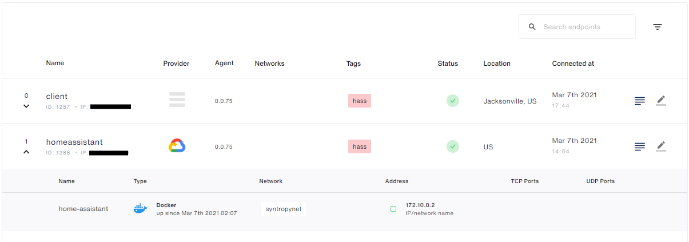
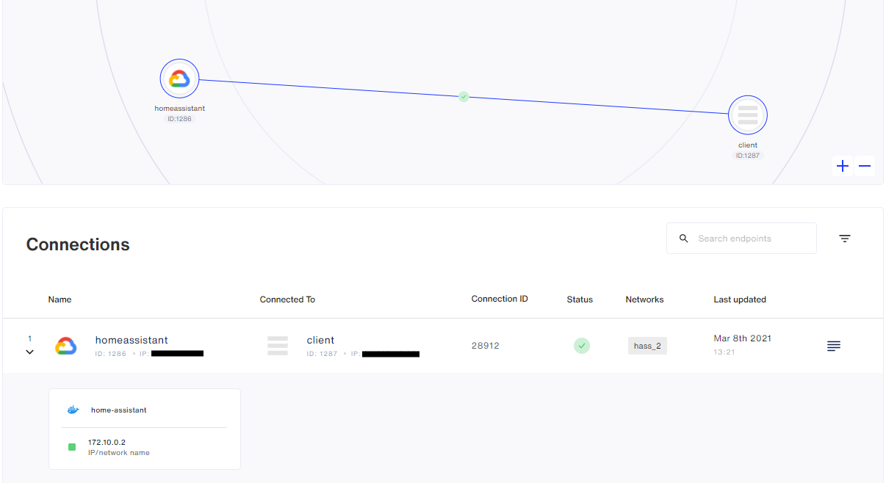
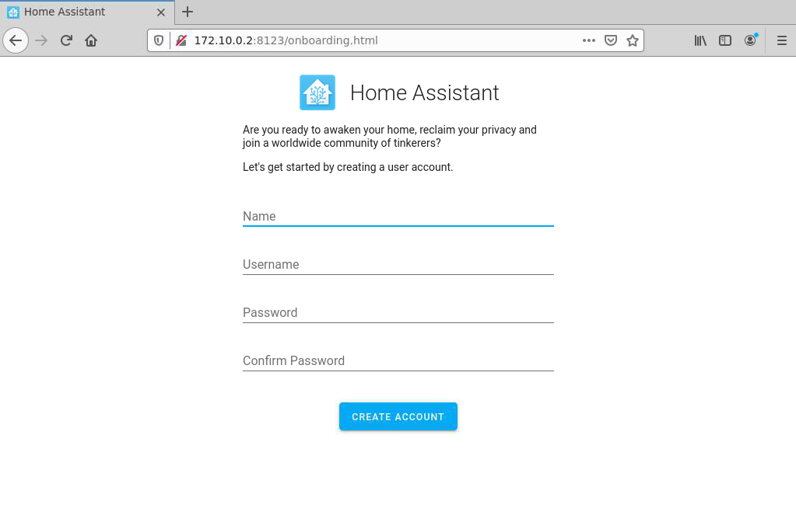

# Home Assistant + Ansible + Syntropy CLI
This tutorial is going to demonstrate how to start and configure a Syntropy network using Ansible consisting of Home Assistant running in a server behind NAT.

```
+-------------------------------------------------------------------------------------+
|                                                                                     |
|    VM1 172.10.0.2                                         CLIENT                    |
|    +--------------------+                                 +--------------------+    |
|    |                    |                                 |                    |    |
|    | +----------------+ |                                 | +----------------+ |    |
|    | | Syntropy Agent | |                                 | | Syntropy Agent | |    |
|    | |                | |         +-----------+           | |                | |    |
|    | +----------------+ |         |           |           | +----------------+ |    |
|    | +----------------+ |---------|    NAT    |---------- |                    |    |
|    | | Home Assistant | |         |           |           |                    |    |
|    | |                | |         +-----------+           |                    |    |
|    | +----------------+ |                                 |                    |    |
|    |                    |                                 |                    |    |
|    |                    |                                 |                    |    |
|    +--------------------+                                 +--------------------+    |
|                                                                                     |
|                                                                                     |
|                                                                                     |
+-------------------------------------------------------------------------------------+
```

## Requirements
- [Syntropy Stack](https://www.syntropystack.com/) account
- A remote server behind NAT
- Python >= 3.6
- Ansible

## Ansible configuration
To begin with, you have to install Syntropy Ansible Galaxy Collection:
```
ansible-galaxy collection install git@github.com:SyntropyNet/syntropy-ansible-collection.git
```
Then you have to navigate to the local ansible directory (on Linux it was here):
```
~/.ansible/collections/ansible_collections/syntropynet/syntropy
```
and install Python dependencies:
```
pip3 install -r requirements.txt
```

Next, you have to rename ``sample.secrets.yaml`` to ``secrets.yaml``.
You will have to input:
 - your agent token, which can be retrieved from [here](https://platform.syntropystack.com/).
 - Syntropy API URL
 - Syntropy Stack account's username (email)
 - Syntropy Stack account's password

You have to rename ```sample.syntropyhosts``` to ```syntropyhosts``` and include information of your hosts.

You will also have to rename ```sample.config.yaml``` to ```config.yaml``` and set the desired name for your host and remote server running home assistant.

You might also want to change the timezone used by the Home Assistant and provider of Syntropy Agent running on the remote server. To do that you have to modify the ``deploy.yaml`` file.

## Configuring virtual machines

You have to install the required dependencies:
- Wireguard. Installation instructions can be found [here](https://www.wireguard.com/install/)
- Docker. Installation instructions can be found [here](https://docs.docker.com/get-docker/)
- Docker Python SDK ``pip3 install docker``

### Host
If your machine is running Ubuntu, you can run this playbook, which will install dependencies automatically:
```
sudo ansible-playbook configure-host.yaml
```

### Remote VM
If your VM is running Ubuntu, you can run this playbook, which will install dependencies automatically
```
ansible-playbook configure-ha.yaml -i syntropyhosts
```

## Deployment

To deploy Home Assistant and syntropy client on both host and the remote VM, run:
```
sudo ansible-playbook deploy.yaml -i syntropyhosts
```

## Confirm that your endpoints are working
Navigate to Syntropy UI and you should see something like this:


## Network configuration
To create Syntropy network run this playbook:
```
ansible-playbook create-network.yaml
```

In Syntropy UI, you should be able to see the network which should be similar to this:


Now you can request the webpage on the host device and it should load:


## Troubleshooting

### Webpage doesn't load
If after following all these steps the webpage won't load, you have to reduce the mtu of the Wireguard interface handling connection to your host device, on the VM where Home Assistant is running, from 1420 to 1400.
This can be done manually:
```
ip link set mtu 1400 dev <interface>
```
You can also use the provided playbook, but it will set mtu to 1400 for **ALL** Wireguard interfaces
```
ansible-playbook set-mtu.yaml -i syntropyhosts
```
