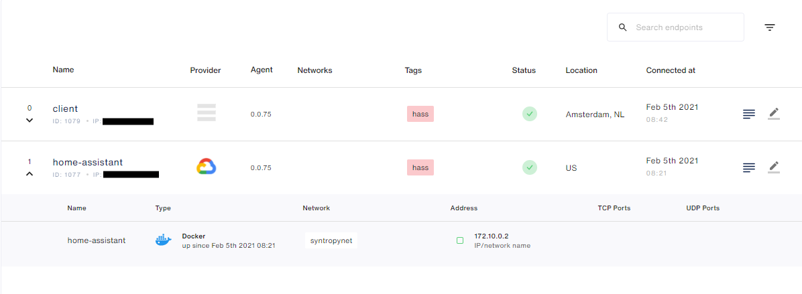
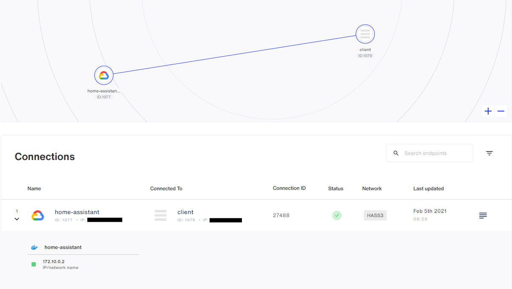
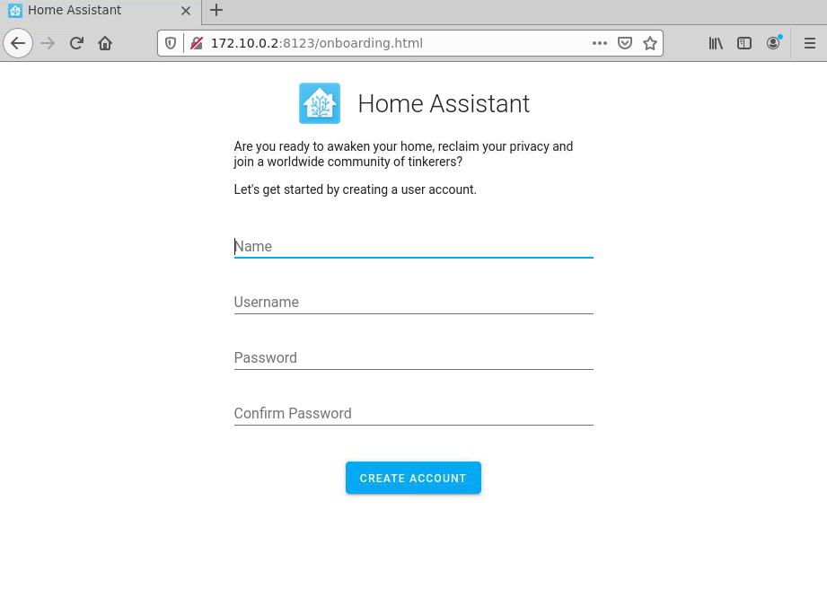

# Home Assistant + Ansible + Syntropy CLI
This tutorial is going to demonstrate how to start and configure a Syntropy network using Ansible and Syntropy CLI consisting of Home
Assistant running in a server behind NAT.

## Requirements
- [Syntropy Stack](https://www.syntropystack.com/) account
- A remote server behind NAT
- Python >= 3.6
- Ansible

## Ansible configuration
To behind with, you have to install Syntropy Ansible Galaxy Collection:
```
ansible-galaxy collection install git@github.com:SyntropyNet/syntropy-ansible-collection.git
```
Then you have to navigate to the local ansible directory and install Python dependencies:
```
pip3 install -r requirements.txt
```
or (at the time of writing this, it might change in the future. Up to date information can be found [here](https://docs.syntropystack.com/docs/ansible-installation))
```
pip3 install syntropy-sdk syntropynac pyyaml jinja2
```

Next, you have to rename ``sample.secrets.yaml`` to ``secrets.yaml`` and input your agent token, which can be retrieved from [here](https://platform.syntropystack.com/).

You have to rename ```sample.syntropyhosts.yaml``` to ```syntropyhosts.yaml``` and include information of your hosts

You might also want to change the timezone used by the Home Assistant and provider of Syntropy Agent running on the remote server. To do that you have to modify the ``deploy.yaml`` file.

## Configuring virtual machines

You have to install the required dependencies:
- Wireguard. Installation instructions can be found [here](https://www.wireguard.com/install/)
- Docker. Installation instructions can be found [here](https://docs.docker.com/get-docker/)
- Docker Python SDK ``pip3 install docker``

### Host
If your machine is running Ubuntu, you can run this playbook, which will install dependencies automatically:
```
sudo ansible-playbook configure-host.yaml
```

### Remote VM
If your VM is running Ubuntu, you can run this playbook, which will install dependencies automatically
```
ansible-playbook configure-ha.yaml -i syntropyhosts.yaml
```

## Deployment

To deploy Home Assistant and syntropy client on both host and the remote VM, run:
```
sudo ansible-playbook deploy.yaml -i syntropyhosts.yaml
```

## Confirm that your endpoints are working
Navigate to syntropy UI and you should see something like this:


## Network configuration
### Installation
To carry out the network configuration, you have to install Syntropy CLI
```
pip3 install syntropycli
```
and Syntropy NAC
```
pip3 install syntropynac
```
### Authentication
First of all, you have to add Syntropy API URL to your ENV
```
SYNTROPY_API_SERVER=https://controller-prod-server.syntropystack.com
```
then, you have to generate an API Token (not to be confused with the Agent Token)
```
syntropyctl login {syntropy-username} {syntropy-password}
```
and also add it to your ENV
```
SYNTORPY_API_TOKEN={api-token}
```
### Creating a network
To make sure that you are properly authenticated, run:
```
syntropyctl get-endpoints
```
and you should see all of your endpoints in a table like this:
```
+----------+----------------+----------------+-----------------------+-----------+--------+------+
| Agent ID |      Name      |   Public IP    |        Provider       |  Location | Online | Tags |
+----------+----------------+----------------+-----------------------+-----------+--------+------+
|   1079   |     client     |     *.*.*.*    |           -           | Amsterdam |  True  | hass |
|   1077   | home-assistant |     *.*.*.*    | Google Cloud Platform |           |  True  | hass |
+----------+----------------+----------------+-----------------------+-----------+--------+------+
```
Now, to create the network run:
```
syntropynac configure-networks network/HASS3.yaml
```
Which should output:
```
Configuring network HASS3
Created network HASS3 with id *
Created 1 connections for network HASS3
Configured 1 connections and 1 subnets for network HASS3
Done
```
In Syntropy UI, you should be able to see the network which should be similar to this:


Now you can request the webpage on the host device and it should load:


## Troubleshooting

### Webpage doesn't load
If after following all these steps the webpage won't load, you have to reduce the mtu of the Wireguard interface handling connection to your host device, on the VM where Home Assistant is running, from 1420 to 1400.
This can be done manually:
```
 ip link set mtu 1400 dev <interface>
```
You can also use the provided playbook, but it will set mtu to 1400 for **ALL** Wireguard interfaces
```
ansible-playbook set-mtu.yaml -i syntropyhosts.yaml
```
