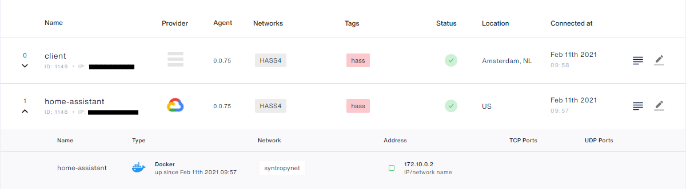
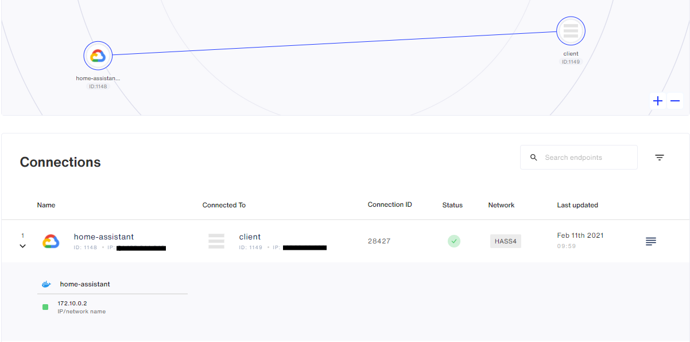
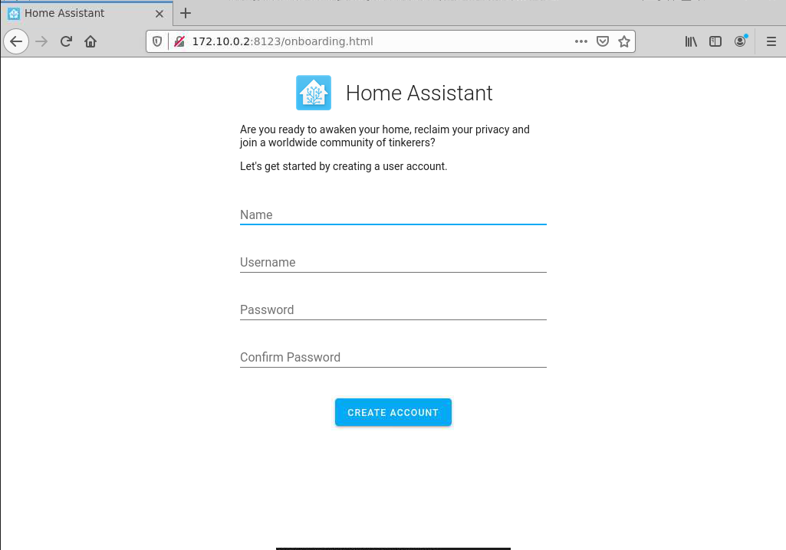

# Home Assistant + Syntropy CLI
This tutorial is going to demonstrate how to start and configure a Syntropy network using Syntropy CLI consisting of Home
Assistant running in a server behind NAT.

```
+-------------------------------------------------------------------------------------+
|                                                                                     |
|     VM1 172.10.0.2                                        CLIENT                    |
|    +--------------------+                                 +--------------------+    |
|    |                    |                                 |                    |    |
|    | +----------------+ |                                 | +----------------+ |    |
|    | | Syntropy Agent | |                                 | | Syntropy Agent | |    |
|    | |                | |         +-----------+           | |                | |    |
|    | +----------------+ |         |           |           | +----------------+ |    |
|    | +----------------+ |---------|    NAT    |---------- |                    |    |
|    | | Home Assistant | |         |           |           |                    |    |
|    | |                | |         +-----------+           |                    |    |
|    | +----------------+ |                                 |                    |    |
|    |                    |                                 |                    |    |
|    |                    |                                 |                    |    |
|    +--------------------+                                 +--------------------+    |
|                                                                                     |
|                                                                                     |
|                                                                                     |
+-------------------------------------------------------------------------------------+
```

## Requirements
- [Syntropy Stack](https://www.syntropystack.com/) account
- Remote server behind NAT
- Python >= 3.6
- Host running Linux
- Wireguard should be installed on both systems. Installation instructions can be found [here](https://www.wireguard.com/install/)
- Docker should be installed on both systems. Installation instructions can be found [here](https://docs.docker.com/get-docker/)

## Configuring remote VM and host
### Remote VM
First, you will need to start a Syntropy Agent
```
sudo docker run --network="host" --restart=on-failure:10 --cap-add=NET_ADMIN --cap-add=SYS_MODULE \
-v /var/run/docker.sock:/var/run/docker.sock:ro \
--device /dev/net/tun:/dev/net/tun --name=syntropynet-agent \
-e SYNTROPY_API_KEY={agent-token} \
-e SYNTROPY_PROVIDER={vm-provider} \
-e SYNTROPY_AGENT_NAME=home-assistant \
-e SYNTROPY_NETWORK_API='docker' \
-e SYNTROPY_TAGS={tags} \
-d syntropynet/agent:latest
```
Providers' ids can be found [here](https://docs.syntropystack.com/docs/syntropy-agent-variables). Agent token can be generated [here](https://platform.syntropystack.com).

Next, you have to create a Docker network
```
sudo docker network create --subnet 172.10.0.0/24 syntropynet
```
and start Home Assistant container
```
docker run -d --name=home-assistant -v /PATH_TO_YOUR_CONFIG:/config -v /etc/localtime:/etc/localtime:ro --net=syntropynet homeassistant/home-assistant:stable
```

### Host
All you have to do is start a Syntropy Agent:

```
sudo docker run --network="host" --restart=on-failure:10 --cap-add=NET_ADMIN --cap-add=SYS_MODULE \
-v /var/run/docker.sock:/var/run/docker.sock:ro \
--device /dev/net/tun:/dev/net/tun --name=syntropynet-agent \
-e SYNTROPY_API_KEY={agent-token} \
-e SYNTROPY_PROVIDER={vm-provider} \
-e SYNTROPY_AGENT_NAME=client \
-e SYNTROPY_NETWORK_API='docker' \
-e SYNTROPY_TAGS={tags} \
-d syntropynet/agent:latest
```
### Confirm that your endpoints are working
Navigate to Syntropy UI and you should see something like this:

## Network configuration
### Installation
To carry out the network configuration, you have to install Syntropy CLI
```
pip3 install syntropycli
```
and Syntropy NAC
```
pip3 install syntropynac
```
### Authentication
First of all, you have to add Syntropy API URL to your ENV
```
SYNTROPY_API_SERVER=https://controller-prod-server.syntropystack.com
```
then, you have to generate an API Token (not to be confused with the Agent Token)
```
syntropyctl login {syntropy-username} {syntropy-password}
```
and also add it to your ENV
```
SYNTROPY_API_TOKEN={api-token}
```
### Creating a network
To make sure that you are properly authenticated, run:
```
syntropyctl get-endpoints
```
and you should see all of your endpoints in a table like this:
```
+----------+----------------+----------------+-----------------------+-----------+--------+------+
| Agent ID |      Name      |   Public IP    |        Provider       |  Location | Online | Tags |
+----------+----------------+----------------+-----------------------+-----------+--------+------+
|   1148   | home-assistant |     *.*.*.*    | Google Cloud Platform |           |  True  | hass |
|   1149   |     client     |     *.*.*.*    |           -           | Amsterdam |  True  | hass |
+----------+----------------+----------------+-----------------------+-----------+--------+------+
```
Now, to create the network run:
```
syntropynac configure-networks network/HASS4.yaml
```
Which should output:
```
Configuring network HASS4
Created network HASS4 with id *
Created 1 connections for network HASS4
Configured 1 connections and 1 subnets for network HASS4
Done
```
In Syntropy UI, you should be able to see the network which should be similar to this:


Now you can request the webpage on the host device and it should load:


## Troubleshooting

### Webpage doesn't load
If after following all these steps the webpage won't load, you have to reduce the mtu of the Wireguard interface handling connection to your host device, on the VM where Home Assistant is running, from 1420 to 1400.

First, you will need to find the interface
```
wg show
```
and then set the mtu:
```
 ip link set mtu 1400 dev <interface>
```
