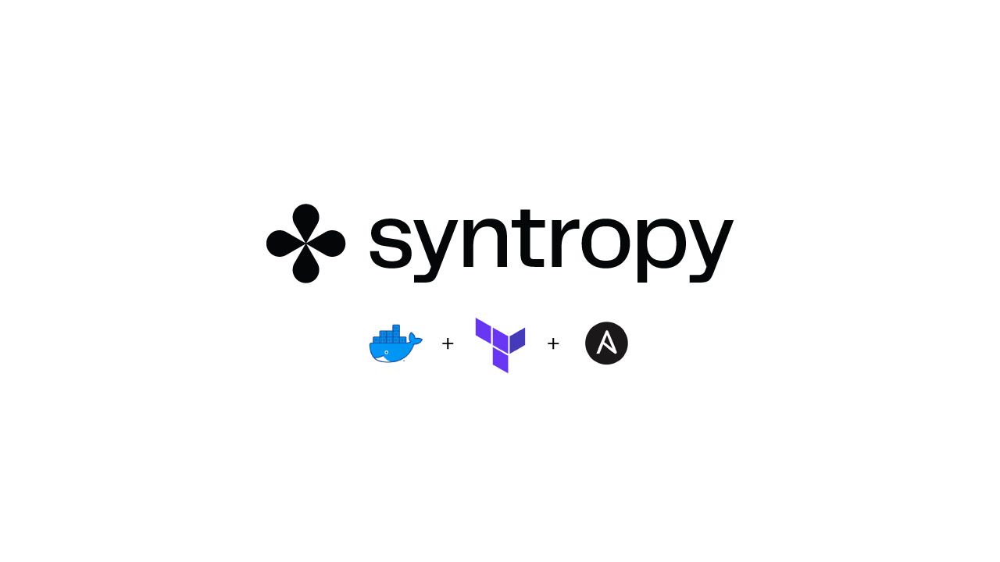
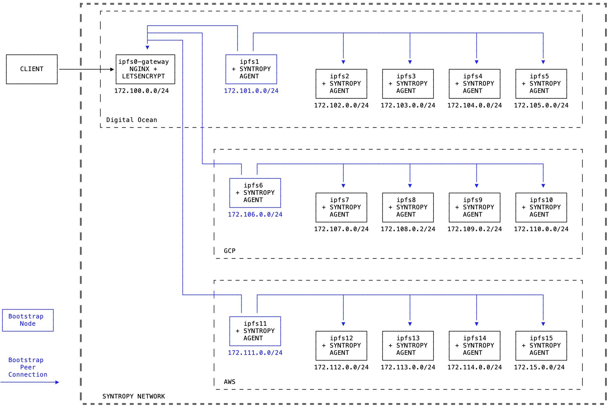
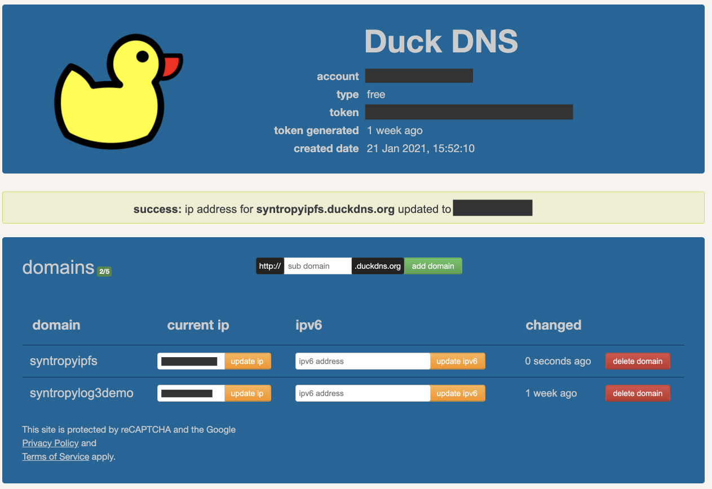
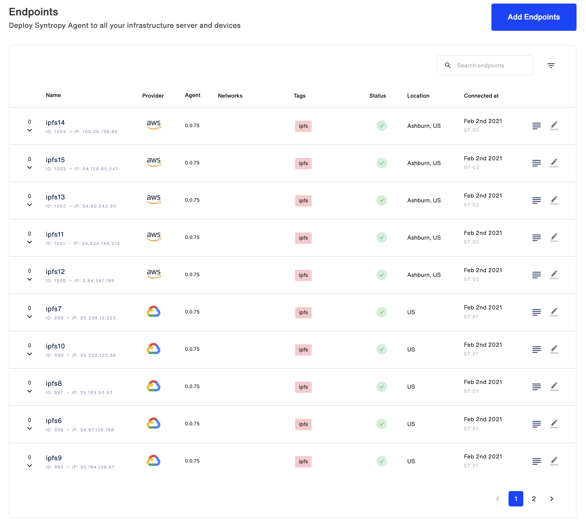
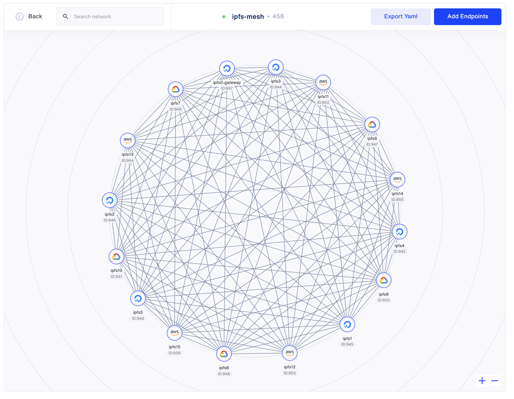
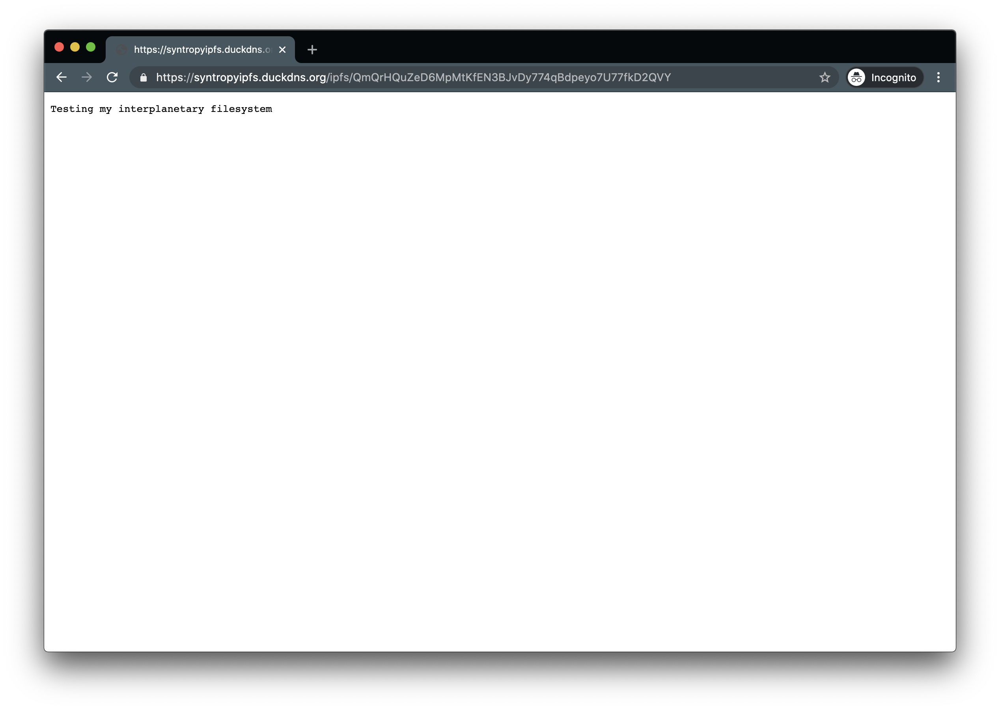

<p align="center">

</p>

This examples describes how to use the **Syntropy Stack** to create a private IPFS swarm network with 16 nodes. Terraform is used to create the cloud infrastructure across three separate cloud providers. The virtual machines are then configured using Ansible. Ansible is also used to creat the Syntropy Network and the connections between the Nodes.



# Requirements

- **Syntropy Stack** account and an active Agent Token
- No ports exposed to the internet (except 80 and 443 on the gateway node)
- All services must run in Docker containers
- Ansible >= 2.9.17
- Python >= 3.6
- Terraform ( 13.0 >= version < 14.0)
- Access to the gateway must be restricted to a single node via https

While you can use any cloud providers you wish, the terraform workflow in this example focuses on AWS, GCP, and Digital Ocean.

# Prepare the Syntropy Stack

Install the Syntropy CLI. Additional info can be found in the docs, [here](https://docs.syntropystack.com/docs/syntropy-ctl-installation).

```
pip3 install syntropycli
```

Rename the `ansible/sample.secrets.yaml` file to `ansible/secrets.yaml` and add your Agent Token (generated via Syntropy UI) to the `api_key` variable.

Add the Api Server URL to your environment (it is recommended it to add it to your `.bashrc` or `.zshrc` depending on your shell of choice).

```
export SYNTROPY_API_SERVER=https://controller-prod-server.syntropystack.com
```

Next, we need to generate an API Token (not to be confused with your Agent Token). To generate an API Token, install the [Syntropy CLI](https://github.com/SyntropyNet/syntropy-cli).

Generate an API Token by logging in using the CLI:

```
syntropyctl login {syntropy stack user name} { syntropy stack password}
```

Copy the API token and add it to your ENV, for example via your `.bashrc` file. You'll need to add the API URL, as well as your username in password.

```
export SYNTROPY_API_TOKEN="your_syntropy_api_token"
export SYNTROPY_PASSWORD="your_syntropy_password"
export SYNTROPY_USERNAME="your_syntropy_username"
```

If Ansible is not already installed, you can do so using pip3. Make sure it installs version >= 2.9.17

```
pip3 install ansible
```

Install Syntropy NAC.

```
pip3 install syntropynac
```

Install the Syntropy Ansible Galaxy Collection.

```
ansible-galaxy collection install git@github.com:SyntropyNet/syntropy-ansible-collection.git
```

Navigate to your local ansible directory, for example on Mac OS:

```
cd /Users/{user}/.ansible/collections/ansible_collections/syntropynet/syntropy
```

Install the Python dependencies.

```
pip3 install -U -r requirements.txt
```

# Terraform setup

In order for Terraform to authenticate for your cloud providers, you will need to enable programmatic access to each.

First, rename `infrastructure/terraform.tfvars.example` to `infrastructure/terraform.tfvars`. All references to variables in this section can be found in this file.

**Digital Ocean**

- A personal access token set to the `do_token` variable.
- The location of your SSH private key set to `pvt_key`

**AWS**

- An IAM user for programmatic access with Administrator priviliges (do not use this for production, you should restrict the scope of any production IAM user's access). Add the credentials to your `~/.aws/credentials` file.

Eg.

```
[syntropy]
aws_access_key_id="your_access_key_here"
aws_secret_access_key="your_secret_access_key_here"
```

- Set the `ssh_public_key` variable to the location of your SSH public key.
- Give the key-pair a name and set `ec2_keypair_name` (this is what it will appear as in AWS)

**GCP**

- Create a project via the GCP console and set the project ID as the `app_project` variable.
- Create a service account ( `APIs & Services > Credentials` ) and download JSON credentials. Place these in the `/auth` directory and set the `gcp_auth_file` variable using the path to your credentials file.
- Enable the Compute Engine API
- Enable the Resource Manager API

# Prepare the Nginx proxy for the gateway

Before you can configure the proxy playbook you need to configure your DNS and set your `htpasswd` credentials.

For this example, we'll use [DuckDNS](https://www.duckdns.org/). DuckDNS is a free service that will allow you to point a DNS ( a subdomain of your choosing for `duckdns.org`) to an IP address of your choice, ie. your VM hosting the `ipfs0-gateway` node. The easiest way to get access is to sign in using your Google / Reddit / Github Twitter account.



Create a subdomain, for example `syntropyifps` (yours will need to be unique, ie different to this) and update your current IP using your `ipfs0-gateway` VM's public IP address. Next, add your subdomain to the `secrets.yaml` file.

```
duck_dns_domain: "syntropyifps.duckdns.org"
```

We want basic authentication in place to restrict access to the Kibana instance, so we need to generate credentials using `htpasswd`. You can create your credentials at: https://www.web2generators.com/apache-tools/htpasswd-generator

Set your `Username` and `Password`, then generate the `.htpasswd` file. Copy the contents of the file and place it in the `ansible/secrets.yaml` file along with your username and password.

```
htpasswd_user: "" #
htpasswd_password: ""
htpasswd_credentials: "" # the contents of the .htpasswd file
```

You'll use the username and password when accessing Kibana through the browser.

Lastly, we use [letsencrypt-nginx-proxy-companion](https://github.com/nginx-proxy/docker-letsencrypt-nginx-proxy-companion) to handle the SSL certificate and redirect traffic on port 80 to port 443. Add your email address to the `secrets.yaml` file.

```
letsencrypt_email: "" # your email address to attach to your letsencrypt cert
```

# Create the hosting infrastructure

Navigate to the `infrastructure/` directory and initialize the Terraform working directory. This will download the required provider modules etc.

```
terraform init
```

Create the execution plan.

```
terraform plan
```

Inspect the generated plan and, if everything looks satisfactory, apply the changes. You'll be asked to enter a value of `yes` to execute the plan.

```
terraform apply
```

Login to your various cloud provider consoles to confirm your VMs are running. If you run into any problems with any of the above steps, you can change the log level for Terraform to receive more information using:

```
export TF_LOG=1
```

Terraform generates your Ansible inventory automagically using the `infrastructure/ansible_inventory.tmpl` file and places it at `ansible/inventory`. Inspect the file to confirm each of your `[digitalocean]`, `[gcp]`, and `[aws]` groups contain configuration for its five hosts.

# Deploy the IPFS nodes

Navigate to the `ansible/` directory using `cd ../ansible`. First, provision your VMs by installing Docker, Wireguard, and the required Python dependencies.

`ansible-playbook provision_hosts.yaml -i inventory -vv`

Before deploying the IPFS network, you need to generate a swarm key which ensures your network is private and prevents unauthorized peers from joining the network.

SSH into one of your Linux VMs and run the following command. (if you don't want to do this on one of your VMs, you can alternatively download [this](https://github.com/Kubuxu/go-ipfs-swarm-key-gen) key generator for Mac OS that utilizes go).

```
echo -e "/key/swarm/psk/1.0.0/\n/base16/\n`tr -dc 'a-f0-9' < /dev/urandom | head -c64`" > swarm.key
```

View the contents of the file using `cat ./swarm.key` and copy it to your clipboard. It should look like this:

```
/key/swarm/psk/1.0.0/
/base16/
1285fc.......................................4821fc
```

On your local machine create a new file, Eg. `vim swarm.key` and paste the contents into it. You need to copy this file and place it in both `ansible/roles/launch_ipfs_node/files/swarm.key` and `ansbile/roles/launch_gateway_ipfs_node/files/swarm.key`. Delete the original file. The `swarm.key` will be copied to the nodes during the Ansible deploy. Next, deploy the nodes.

`ansible-playbook deploy_ipfs_nodes.yaml -i inventory -vv`

Check the Syntropy UI's `End-points` section to ensure your nodes are all online, or use the `syntropyctl get-endpoints` command.



# Bootstrap the IPFS nodes

A private IPFS swarm network needs to provide a list of peers to bootstrapping nodes. Run the `configure_peers.yaml` playbook to add the peers to the bootstrap lists of the bootstrap nodes.

```
ansible-playbook configure_peers.yaml -i inventory -vv
```

# Create the Syntropy network

Create the Syntropy Network using the SyntropyNAC command line utility.

```
syntropynac configure-networks networks/ipfs.yml
```

Confirm your network is online via Syntropy UI and that the connections have been made.



# Check for swarm peers

Check that the peers have connected to the swarm network:

```
ansible-playbook check_swarm_peers.yaml -i inventory
```

Your output should look something like this for each of the nodes:

```
ok: [ipfs15] =>
  msg: |-
    /ip4/10.69.0.116/tcp/4001/p2p/12D3KooWGLUdhZqVNoBn5uNieknFc2KfaaxX8ZBqGZtmZ4kwc7Ac
    /ip4/10.69.0.118/tcp/4001/p2p/12D3KooWEWkahNb3xLdkmwFiNkjjTvpwXCd7Yjf9KKQUixudz5UH
    /ip4/10.69.0.119/tcp/4001/p2p/12D3KooWP19txmcCntvyW6rHj1pqbQGj8iHniPR3eGovLBrHucm2
    /ip4/10.69.0.120/tcp/60150/p2p/12D3KooWJDRg63qafZNhbLnjRMZydQSAGH1zrtM36cAMvpAKjwZB
    /ip4/10.69.0.126/tcp/4001/p2p/12D3KooWPzEiP3fUHwJUZBsmcJG8JaVaS7Hu2XBkbPAnY4SBsRPj
    /ip4/10.69.0.130/tcp/4001/p2p/12D3KooWCTSRYxexC8mw2vvNfZVWaLvZK9h26QczRh9XapB9kx4T
    /ip4/10.69.0.131/tcp/4001/p2p/12D3KooWFW5Zy1pmt9WaaW1i7fkxLZ9LSgDwhbJiZ9Gd56pZvTmB
    /ip4/10.69.0.132/tcp/4001/p2p/12D3KooWKxYbKgnBPmksisLosM6TF6CUqaRJNCs9sBshiUfXZVJm
    /ip4/10.69.0.134/tcp/4001/p2p/12D3KooWF1qZDBp2LMn4FWHvjBuSkcHLeW6kH9KCTC3vVbAta9XK
    /ip4/172.100.0.2/tcp/4001/p2p/12D3KooWQ41votY5d8CnDYhsHqxdVW3kvdm3wHMo71iKuQc582QN
    /ip4/172.103.0.2/tcp/4001/p2p/12D3KooWT1So7SStKPfViXaVK9MSbEdakHPrEhiviKDeY7unnf52
    /ip4/172.107.0.2/tcp/4001/p2p/12D3KooWGLUdhZqVNoBn5uNieknFc2KfaaxX8ZBqGZtmZ4kwc7Ac
    /ip4/172.111.0.2/tcp/4001/p2p/12D3KooWFW5Zy1pmt9WaaW1i7fkxLZ9LSgDwhbJiZ9Gd56pZvTmB
    /ip4/172.112.0.2/tcp/4001/p2p/12D3KooWNzo5tcJVLv4LcYSuM3nyuDJMeKtaw7PZmFvGCDE3NrtT
    /ip4/172.114.0.2/tcp/4001/p2p/12D3KooWCcWn9kMrEZUU4VbaZGcv7rRRFStR6vZzBnTtFhbG1fVr
```

# Add a file to your IPFS network

SSH into one (any of your VMs) and shell into the `ipfs` container. Eg.

```
ssh ~/.ssh/syntropy_rsa <vm_user>@<vm_ip>
```

and

```
docker exec -it <container_name> sh
```

Create a text file and add some content to it. Eg.

```
echo "Testing my interplanetary filesystem" > ipfs.txt
```

Add it to the filesystem.

```
ipfs add ipfs.txt
```

You should see output like this:

```
added QmQrHQuZeD6MpMtKfEN3BJvDy774qBdpeyo7U77fkD2QVY ipfs.txt
 37 B / 37 B [==================================] 100.00%
```

Copy the Content Identifier (CID), ie. the alphanumeric string following "added". Then, SSH into a different VM - try one on a different cloud provider. Shell into the `ipfs` Docker container and execute the following:

```
ipfs cat <your_CID>
```

You should see the content of your file in the output:

```
/ # ipfs cat QmQrHQuZeD6MpMtKfEN3BJvDy774qBdpeyo7U77fkD2QVY
Testing my interplanetary filesystem
```

So, we can see that our file is accessible from a different IPFS, and thus across the entire swarm. The final step is to access the file in a browser via our gateway.

# Access the gateway

Be aware, you will be prompted for a username and password when entering your gateway URL as the Gateway's Nginx proxy has been configured for basic authentication. Use the values stored in your `ansible/secrets.yaml` file. Your DuckDNS domain will be followed by `/ipfs/your_cid`.

Eg.

```
https://syntropyipfs.duckdns.org/ipfs/QmQrHQuZeD6MpMtKfEN3BJvDy774qBdpeyo7U77fkD2QVY
```

You'll see the contents of your `ipfs.txt` file available in your browser.



**Congratulations, your architecture is up and running ;-)**
