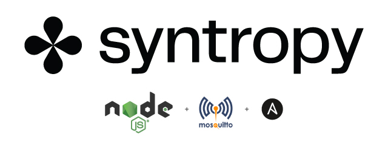
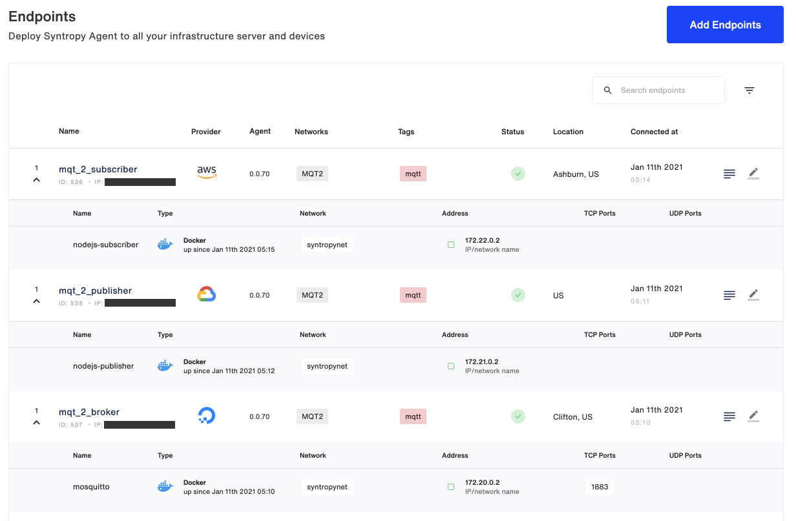
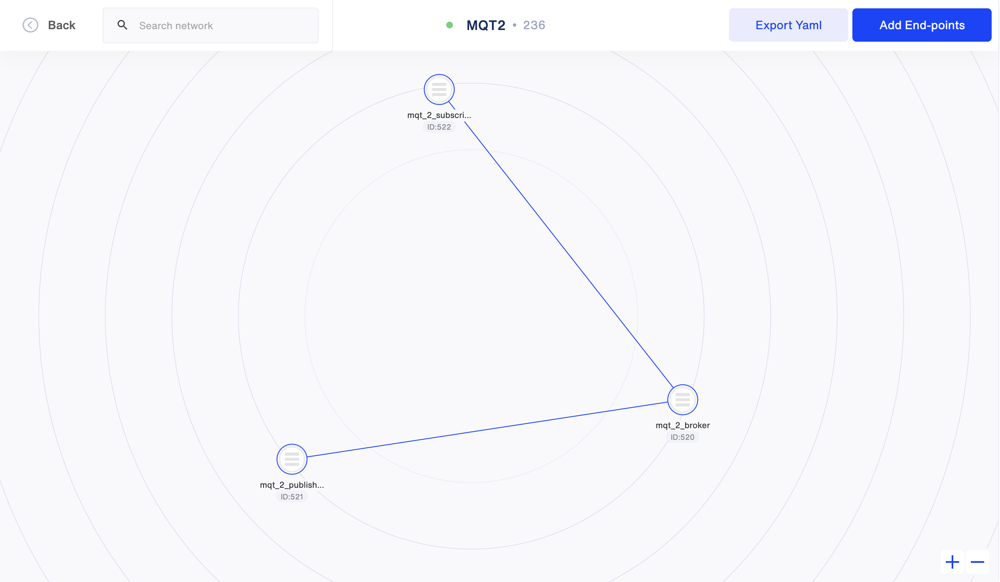

<p align="center">

</p>

This example describes how to use the **Syntropy Stack**, together with Ansible, to create an MQTT network with 3 nodes: A Broker, a Publisher and a Subscriber. It makes use of [Eclipse Mosquitto](https://mosquitto.org) as the MQTT Broker and the Publisher and Subscriber are simple NodeJS apps. Each of the three nodes will run on a separate VM. Dedicated playbooks will be used to provision each Endpoint, then the network itself.

```
                     BROKER
                     ┌ ─ ─ ─ ─ ─ ─ ─ ─ ─ ─ ─ ─ ─ ┐

                     │     172.20.0.0            │
                          ┌────────────────┐
                     │    │    Moquitto    │     │
                          │  MQTT Broker   │
                     │    │                │     │
                          └────────────────┘
                     │    ┌────────────────┐     │
                          │                │
                     │    │ Syntropy Agent │     │
                          │                │
                     │    └────────────────┘     │

                     └ ─ ─ ─ ─ ─ ─ ─ ─ ─ ─ ─ ─ ─ ┘
                                ▲      │
                                │      │
                                │      │
                                │      │
                                │      │
               ┌────────────────┘      └──────────────────┐
               │                                          │
               │                                          │
 PUBLISHER     │                           SUBSCRIBER     ▼
  ┌ ─ ─ ─ ─ ─ ─ ─ ─ ─ ─ ─ ─ ─ ┐             ┌ ─ ─ ─ ─ ─ ─ ─ ─ ─ ─ ─ ─ ─ ┐

  │                           │             │                           │
       ┌────────────────┐                        ┌────────────────┐
  │    │    Syntropy    │     │             │    │    Syntropy    │     │
       │     Agent      │                        │     Agent      │
  │    └────────────────┘     │             │    └────────────────┘     │
       ┌────────────────┐                        ┌────────────────┐
  │    │     NodeJS     │     │             │    │     NodeJS     │     │
       │   Publisher    │                        │   Subscriber   │
  │    └────────────────┘     │             │    └────────────────┘     │

  │     172.21.0.0            │             │     172.22.0.0            │

  └ ─ ─ ─ ─ ─ ─ ─ ─ ─ ─ ─ ─ ─ ┘             └ ─ ─ ─ ─ ─ ─ ─ ─ ─ ─ ─ ─ ─ ┘
```

# Requirements

- **Syntropy Stack** account and an active Agent Token
- Three separate servers (preferrably running on separate cloud providers)
- Services must run inside docker containers (thus docker needs to be installed on each server)
- The subnets for the docker networks for each of the nodes must be unique
- Wireguard must be installed and running on each server
- No ports (including the MQTT `1883` and `9001`) on the VMs should be open and exposed to the internet.
- Ansible needs to be installed on your Control node (your local machine or whatever machine you will run the playbooks on)
- Python >= 3.6

# Installation

Install the Syntropy Ansible Galaxy Collection.

```
ansible-galaxy collection install git@github.com:SyntropyNet/syntropy-ansible-collection.git
```

Navigate to your local ansible directory, for example on Mac OS:

```
cd /Users/{user}/.ansible/collections/ansible_collections/syntropynet/syntropy
```

Install the Python dependencies.

```
pip3 install -U -r requirements.txt
```

# Authentication

Rename the `sample.secrets.yaml` file to `secrets.yaml` and add your Agent Token (generated via Syntropy UI) to the `api_key` variable.

Next, we need to generate an API Token (not to be confused with your Agent Token). To generate an API Token, install the [Syntropy CLI](https://github.com/SyntropyNet/syntropy-cli).

Generate an API Token by logging in using the CLI:

```
syntropyctl login {syntropy stack user name} { syntropy stack password}
```

Copy the API token and add it to your ENV, for example via your `.bashrc` file. You'll need to add the API URL, as well as your username in password.

```
export SYNTROPY_API_SERVER=https://controller-prod-server.syntropystack.com
export SYNTROPY_API_TOKEN="your_syntropy_api_token"
export SYNTROPY_PASSWORD="your_syntropy_password"
export SYNTROPY_USERNAME="your_syntropy_username"
```

# Provision your Virtual Machines

Update the `syntropyhosts` file to include information for your hosts.

`ansible_ssh_private_key_file`: if any of your VMs require a `.pem` file for SSH access, include the file's location here.

`ansible_host`: VM's IP public IP address

`ansible_user`: Your host's SSH user

Ensure that you have access to your VMs via SSH and that they've been added to your list of authorized keys so that Ansible has access to the VMS.

Each VM requires Docker, Wireguard and Ansible python dependencies to be installed. This can be done using the `provision_hosts.yaml` playbook.

`ansible-playbook provision_hosts.yaml -i syntropyhosts -vv`

# Configure your playbooks

Change the `agent_provider` in each of the service's playbook to match each server's cloud provider, a reference to the providers can be found [here](https://docs.syntropystack.com/docs/syntropy-agent-variables).

# Deploy services

Deploy the Broker:

```
ansible-playbook deploy_broker.yaml -i syntropyhosts -vv
```

Deploy the Publisher:

```
ansible-playbook deploy_publisher.yaml -i syntropyhosts -vv
```

Deploy the Subscriber:

```
ansible-playbook deploy_subscriber.yaml -i syntropyhosts -vv
```

Deploy the Network:

```
ansible-playbook deploy_network.yaml -i syntropyhosts -vv
```

# Confirm your Network is online and functioning

Endpoints


Network:


SSH into your Publisher and Subscriber VMs to view the log output from the NodeJS apps to confirm everything is working as expected.

`docker logs --follow nodejs-publisher`

```
Initializing Publisher
Established connection with Broker
[sending] January 7th 2021, 10:53:05 pm
[sending] January 7th 2021, 10:54:05 pm
[sending] January 7th 2021, 10:55:05 pm
```

`docker logs --follow nodejs-subscriber`

```
Initializing Subscriber
Established connection with Broker
[subscribed] topic: hello_syntropy
[subscribed] topic: init
[received][hello_syntropy] Powered by **Syntropy Stack**: January 7th 2021, 10:53:05 pm
[received][hello_syntropy] Powered by **Syntropy Stack**: January 7th 2021, 10:54:05 pm
[received][hello_syntropy] Powered by **Syntropy Stack**: January 7th 2021, 10:55:05 pm
```

**Congratulations, your architecture is up and running ;-)**
