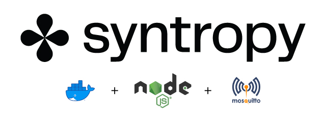
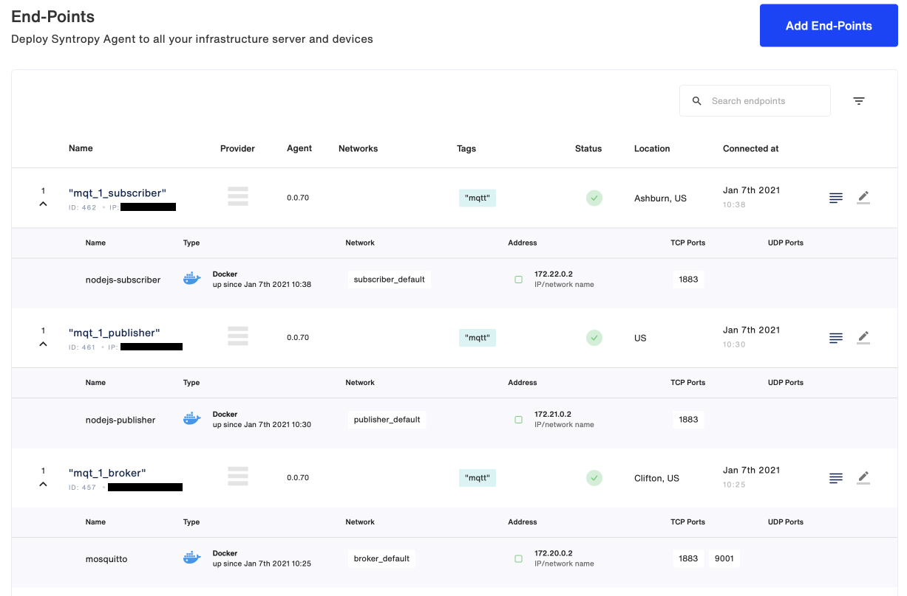
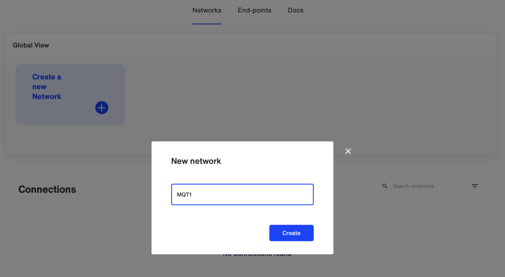
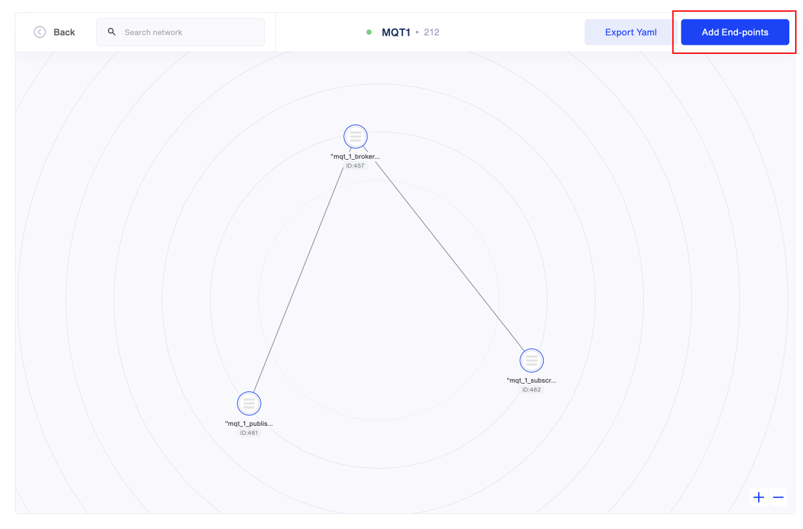
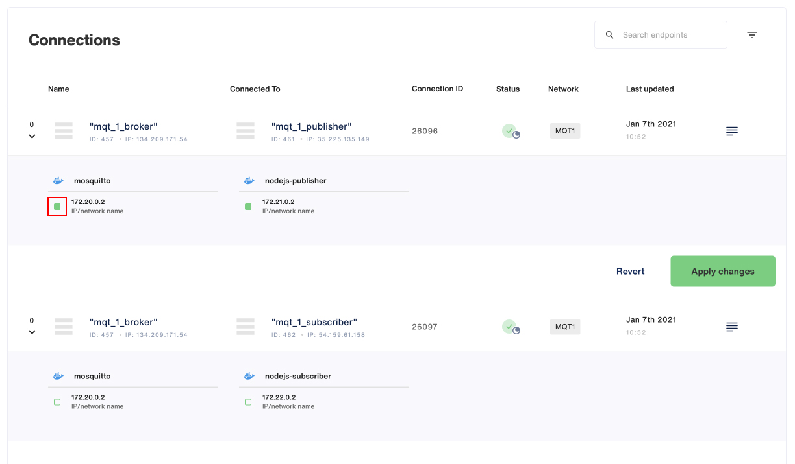

<p align="center">

</p>

This example describes how to create an MQTT network with 3 nodes: A Broker, a Publisher and a Subscriber. It makes use of [Eclipse Mosquitto](https://mosquitto.org) as the MQTT Broker and the Publisher and Subscriber are simple NodeJS apps. You will create the Syntropy network and connections manually using the SyntropyStack UI.

```
                     BROKER
                     ┌ ─ ─ ─ ─ ─ ─ ─ ─ ─ ─ ─ ─ ─ ┐

                     │     172.20.0.0            │
                          ┌────────────────┐
                     │    │    Moquitto    │     │
                          │  MQTT Broker   │
                     │    │                │     │
                          └────────────────┘
                     │    ┌────────────────┐     │
                          │                │
                     │    │ Syntropy Agent │     │
                          │                │
                     │    └────────────────┘     │

                     └ ─ ─ ─ ─ ─ ─ ─ ─ ─ ─ ─ ─ ─ ┘
                                ▲      │
                                │      │
                                │      │
                                │      │
                                │      │
               ┌────────────────┘      └──────────────────┐
               │                                          │
               │                                          │
 PUBLISHER     │                           SUBSCRIBER     ▼
  ┌ ─ ─ ─ ─ ─ ─ ─ ─ ─ ─ ─ ─ ─ ┐             ┌ ─ ─ ─ ─ ─ ─ ─ ─ ─ ─ ─ ─ ─ ┐

  │                           │             │                           │
       ┌────────────────┐                        ┌────────────────┐
  │    │    Syntropy    │     │             │    │    Syntropy    │     │
       │     Agent      │                        │     Agent      │
  │    └────────────────┘     │             │    └────────────────┘     │
       ┌────────────────┐                        ┌────────────────┐
  │    │     NodeJS     │     │             │    │     NodeJS     │     │
       │   Publisher    │                        │   Subscriber   │
  │    └────────────────┘     │             │    └────────────────┘     │

  │     172.21.0.0            │             │     172.22.0.0            │

  └ ─ ─ ─ ─ ─ ─ ─ ─ ─ ─ ─ ─ ─ ┘             └ ─ ─ ─ ─ ─ ─ ─ ─ ─ ─ ─ ─ ─ ┘
```

# Requirements

- SyntropyStack account and an active Agent Token
- Three separate servers (preferrably running on separate cloud providers)
- Services must run inside docker containers (thus docker needs to be installed on each server)
- The subnets for the docker networks for each of the nodes must be unique
- Wireguard must be installed and running on each server
- No ports (including the MQTT `1883` and `9001`) on the VMs should be open

# Prepare the docker-compose files

There's no coding required as all the examples have been prepared for you, you simply need to setup the servers, copy the relevant files, and bring the services online. Finally, you'll connect the endpoints (each node running on its own server is an endpoint in the SyntropyStack).

We'll be creating three nodes, which have corresponding folders in this repo: `broker`, `publisher`, and `subscriber`.

You'll need to replace the `SYNTROPY_API_TOKEN` with your own agent token in the `docker-compose.yaml` file for each node (found in `broker/`, `publisher/` and `subscriber/`). Change the provider to match each server's cloud provider, a reference to the providers can be found [here](https://docs.syntropystack.com/docs/syntropy-agent-variables).

```
services:
  syntropynet-agent:
    image: syntropynet/agent:stable
    hostname: syntropynet-agent
    container_name: syntropynet-agent
    cap_add:
      - NET_ADMIN
      - SYS_MODULE
    environment:
      - SYNTROPY_API_KEY=<YOUR_API_KEY> # <==== Your token goes here
      - SYNTROPY_NETWORK_API=docker
      - SYNTROPY_PROVIDER=<PROVIDER_VALUE> # <==== change this
...
```

# Create your VMs

You need to provision three separate VMs, preferrably on three separate cloud services. Depending on the cloud provider and distribution you select, you may need to install both `docker` and `wireguard`.

Copy each of the service directories (broker|publisher|subscriber) to a different VM using `scp` or your favourite `sftp` client.

Eg.

```
scp -r /path/to/broker <user_name>@<remote_ip>:/broker
```

# 1. Provision the Broker VM

Use docker-compose to run the `mosquitto` and `syntropynet-agent` containers. In the `broker/` directory, run:

```
sudo docker-compose up -d
```

Once the images have been pulled and the containers have been started, check that the containers are running with:

`sudo docker ps`

The output should look something like:

```

CONTAINER ID IMAGE COMMAND CREATED STATUS PORTS NAMES
ff3df53e46d6 eclipse-mosquitto "/docker-entrypoint.…" About an hour ago Up 10 minutes 0.0.0.0:1883->1883/tcp, 0.0.0.0:9001->9001/tcp mosquitto
065e39ce4f8e syntropynet/agent:stable "/usr/local/bin/synt…" About an hour ago Up 10 minutes syntropynet-agent

```

Watch the logs using:

```
sudo docker logs --follow mosquitto
```

Until you create the Syntropy network, you should only see the following output:

```
1610058312: mosquitto version 1.6.12 starting
```

# 2. Configure the Publisher VM

Use docker-compose to run the `nodejs-publisher` and `syntropynet-agent` containers. In the `publisher/` directory, run:

```
sudo docker-compose up -d
```

Once the images have been pulled and the containers have been started, check that the containers are running with:

`sudo docker ps`

The output should look something like:

```
CONTAINER ID        IMAGE                        COMMAND                  CREATED             STATUS              PORTS                    NAMES
225c83523098        publisher_nodejs-publisher   "docker-entrypoint.s…"   40 seconds ago      Up 34 seconds       0.0.0.0:1883->1883/tcp   nodejs-publisher
a73317d8ee99        syntropynet/agent:stable     "/usr/local/bin/synt…"   42 seconds ago      Up 40 seconds                                syntropynet-agent
```

Watch the logs using:

```
sudo docker logs --follow nodejs-publisher
```

Until you create the Syntropy network, you should only see the following output:

```
Initializing Publisher
```

# 3. Configure the Subscriber VM

Use docker-compose to run the `nodejs-subscriber` and `syntropynet-agent` containers. In the `subscriber/` directory, run:

```
sudo docker-compose up -d
```

Once the images have been pulled and the containers have been started, check that the containers are running with:

`sudo docker ps`

The output should look something like:

```
e7980dbe3e81        subscriber_nodejs-subscriber   "docker-entrypoint.s…"   About a minute ago   Up About a minute   0.0.0.0:1883->1883/tcp   nodejs-subscriber
f5794cd97467        syntropynet/agent:stable       "/usr/local/bin/synt…"   About a minute ago   Up About a minute                            syntropynet-agent
```

Watch the logs using:

```
sudo docker logs --follow nodejs-subscriber
```

Until you create the Syntropy network, you should only see the following output:

```
Initializing Subscriber
```

# Create the Syntropy Network

Log into your SyntropyStack Account and navigate to `End-points`, you should see your services online:



Once you've confirmed your endpoints are online, it's time to create your network. Navigate to the `Networks` section of the site, click `Create a new network` and give your network a name:



While still in the `Networks` section, you'll want to click `Add End-points`. Select your three endpoints and click `Add selected` to add them to your network. You'll see your three endpoints appear as nodes on the graph. To create the connections, select the `mqtt_1_broker` node and select the other two nodes in the modal that appears.



Finally, you need to make sure that the services running on each node are connected. In the `Connections` section, under the node graph, select each service and click `Apply Changes`. All the greene squares next to the service IPs should be solid green.



# Test your MQTT network

After creating your connections in the SyntropyStack UI, return to your terminal and you'll see that the Subscriber is receiving a timestamped message being sent by the Publisher!

Publisher:

```
Initializing Publisher
Established connection with Broker
[sending] January 7th 2021, 10:53:05 pm
[sending] January 7th 2021, 10:54:05 pm
[sending] January 7th 2021, 10:55:05 pm
```

Subscriber:

```
Initializing Subscriber
Established connection with Broker
[subscribed] topic: hello_syntropy
[subscribed] topic: init
[received][hello_syntropy] Powered by SyntropyStack: January 7th 2021, 10:53:05 pm
[received][hello_syntropy] Powered by SyntropyStack: January 7th 2021, 10:54:05 pm
[received][hello_syntropy] Powered by SyntropyStack: January 7th 2021, 10:55:05 pm
```

**Congratulations, your architecture is up and running ;-)**
