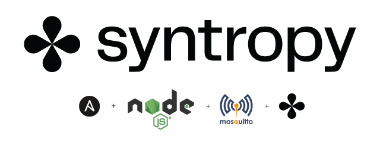
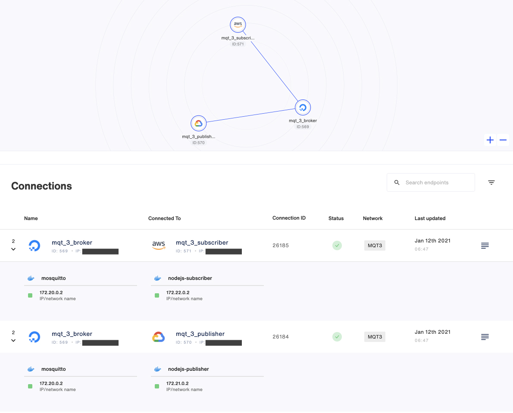

<p align="center">

</p>

This example describes how to use the **Syntropy Stack**, Ansible and the Syntropy CLI to create an MQTT network with 3 nodes: A Broker, a Publisher and a Subscriber. It makes use of [Eclipse Mosquitto](https://mosquitto.org) as the MQTT Broker and the Publisher and Subscriber are simple NodeJS apps. Each of the three nodes will run on a separate VM. Dedicated Ansible playbooks will be used to provision each Endpoint. The network and connections can be created using the CLI or from a YAML template using the SyntropyNAC (Network As Code) command line utility.

```
                     BROKER
                     ┌ ─ ─ ─ ─ ─ ─ ─ ─ ─ ─ ─ ─ ─ ┐

                     │     172.20.0.0            │
                          ┌────────────────┐
                     │    │    Moquitto    │     │
                          │  MQTT Broker   │
                     │    │                │     │
                          └────────────────┘
                     │    ┌────────────────┐     │
                          │                │
                     │    │ Syntropy Agent │     │
                          │                │
                     │    └────────────────┘     │

                     └ ─ ─ ─ ─ ─ ─ ─ ─ ─ ─ ─ ─ ─ ┘
                                ▲      │
                                │      │
                                │      │
                                │      │
                                │      │
               ┌────────────────┘      └──────────────────┐
               │                                          │
               │                                          │
 PUBLISHER     │                           SUBSCRIBER     ▼
  ┌ ─ ─ ─ ─ ─ ─ ─ ─ ─ ─ ─ ─ ─ ┐             ┌ ─ ─ ─ ─ ─ ─ ─ ─ ─ ─ ─ ─ ─ ┐

  │                           │             │                           │
       ┌────────────────┐                        ┌────────────────┐
  │    │    Syntropy    │     │             │    │    Syntropy    │     │
       │     Agent      │                        │     Agent      │
  │    └────────────────┘     │             │    └────────────────┘     │
       ┌────────────────┐                        ┌────────────────┐
  │    │     NodeJS     │     │             │    │     NodeJS     │     │
       │   Publisher    │                        │   Subscriber   │
  │    └────────────────┘     │             │    └────────────────┘     │

  │     172.21.0.0            │             │     172.22.0.0            │

  └ ─ ─ ─ ─ ─ ─ ─ ─ ─ ─ ─ ─ ─ ┘             └ ─ ─ ─ ─ ─ ─ ─ ─ ─ ─ ─ ─ ─ ┘
```

# Requirements

- **Syntropy Stack** account and an active Agent Token
- Three separate servers (preferrably running on separate cloud providers)
- Services must run inside docker containers (thus docker needs to be installed on each server)
- The subnets for the docker networks for each of the nodes must be unique
- Wireguard must be installed and running on each server
- No ports (including the MQTT `1883` and `9001`) on the VMs should be open and exposed to the internet.
- Ansible needs to be installed on your Control node (your local machine or whatever machine you will run the playbooks on)
- Python >= 3.6
- The Syntropy command line

# Installation

Install the Syntropy CLI.

```
pip3 install syntropycli
```

Install the Syntropy Ansible Galaxy Collection.

```
ansible-galaxy collection install git@github.com:SyntropyNet/syntropy-ansible-collection.git
```

Navigate to your local ansible directory, for example on Mac OS:

```
cd /Users/{user}/.ansible/collections/ansible_collections/syntropynet/syntropy
```

Install the Python dependencies.

```
pip3 install -U -r requirements.txt
```

# Authentication

Rename the `sample.secrets.yaml` file to `secrets.yaml` and add your Agent Token (generated via Syntropy UI) to the `api_key` variable.

Next, we need to generate an API Token (not to be confused with your Agent Token). To generate an API Token, install the [Syntropy CLI](https://github.com/SyntropyNet/syntropy-cli).

Generate an API Token by logging in using the CLI:

```
syntropyctl login {syntropy stack user name} { syntropy stack password}
```

Copy the API token and add it to your ENV, for example via your `.bashrc` file. You'll need to add the API URL, as well as your username in password.

```
export SYNTROPY_API_SERVER=https://controller-prod-server.syntropystack.com
export SYNTROPY_API_TOKEN="your_syntropy_api_token"
export SYNTROPY_PASSWORD="your_syntropy_password"
export SYNTROPY_USERNAME="your_syntropy_username"
```

# Provision your Virtual Machines

Update the `syntropyhosts` file to include information for your hosts.

`ansible_ssh_private_key_file`: if any of your VMs require a `.pem` file for SSH access, include the file's location here.

`ansible_host`: VM's IP public IP address

`ansible_user`: Your host's SSH user

Ensure that you have access to your VMs via SSH and that they've been added to your list of authorized keys so that Ansible has access to the VMS.

Each VM requires Docker, Wireguard and Ansible python dependencies to be installed. This can be done using the `provision_hosts.yaml` playbook.

`ansible-playbook provision_hosts.yaml -i syntropyhosts -vv`

# Configure your playbooks

Change the `agent_provider` in each of the service's playbook to match each server's cloud provider, a reference to the providers can be found [here](https://docs.syntropystack.com/docs/syntropy-agent-variables).

# Deploy services

Deploy the Services:

```
ansible-playbook deploy_services.yaml -i syntropyhosts -vv
```

You can check that the endpoints are correctly configured:

```
syntropyctl get-endpoints -j
```

Output should resemble the following:

```
[
    {
        "agent_id": 555,
        "agent_public_ipv4": "redacted",
        "agent_location_city": "",
        "agent_name": "mqt_2_publisher",
        "agent_status": "OK",
        "agent_version": "0.0.70",
        "agent_is_online": true,
        "agent_locked_fields": {
            "agent_location_country": true,
            "agent_location_lat": true,
            "agent_location_lon": true,
            "agent_name": true,
            "agent_provider_name": true,
            "agent_tags": [
                "mqtt"
            ]
        },
        "agent_modified_at": "2021-01-12T02:54:04.958",
        "networks": [],
        "agent_tags": [
            {
                "agent_tag_id": 44,
                "agent_tag_name": "mqtt"
            }
        ],
        "agent_provider": {
            "agent_provider_id": 3,
            "agent_provider_name": "Google Cloud Platform"
        },
        "agent_services": 1,
        "agent_location_country": "US"
    },
    {
        "agent_id": 556,
        "agent_public_ipv4": "redacted",
        "agent_location_city": "Ashburn",
        "agent_name": "mqt_2_subscriber",
        "agent_status": "OK",
        "agent_version": "0.0.70",
        "agent_is_online": true,
        "agent_locked_fields": {
            "agent_location_city": true,
            "agent_location_country": true,
            "agent_location_lat": true,
            "agent_location_lon": true,
            "agent_name": true,
            "agent_provider_name": true,
            "agent_tags": [
                "mqtt"
            ]
        },
        "agent_modified_at": "2021-01-12T02:55:10.146",
        "networks": [],
        "agent_tags": [
            {
                "agent_tag_id": 44,
                "agent_tag_name": "mqtt"
            }
        ],
        "agent_provider": {
            "agent_provider_id": 1,
            "agent_provider_name": "Amazon Web Services"
        },
        "agent_services": 1,
        "agent_location_country": "US"
    },
    {
        "agent_id": 557,
        "agent_public_ipv4": "redacted",
        "agent_location_city": "Clifton",
        "agent_name": "mqt_2_broker",
        "agent_status": "OK",
        "agent_version": "0.0.70",
        "agent_is_online": true,
        "agent_locked_fields": {
            "agent_location_city": true,
            "agent_location_country": true,
            "agent_location_lat": true,
            "agent_location_lon": true,
            "agent_name": true,
            "agent_provider_name": true,
            "agent_tags": [
                "mqtt"
            ]
        },
        "agent_modified_at": "2021-01-12T03:02:56.670",
        "networks": [],
        "agent_tags": [
            {
                "agent_tag_id": 44,
                "agent_tag_name": "mqtt"
            }
        ],
        "agent_provider": {
            "agent_provider_id": 6,
            "agent_provider_name": "DigitalOcean"
        },
        "agent_services": 1,
        "agent_location_country": "US"
    }
]
```

At this stage, you have two options for creating your network:

A - Create the network, and connections, using the CLI

B - Create the network and connections simultaneously using `syntropynac` (Syntropy Network As Code) command line utility, where the network is defined in a YAML file

Both options are presented below.

# Option A - Create network and connections using CLI

```
syntropyctl create-network MQT3 --topology P2M
```

The command will output your network's ID, make a note of this as you'll need it in the upcoming steps.

Enable the each of the services. If you need a reference for the IDs, use:

```
syntropyctl get-endpoints
```

Which yields:

```
+----------+------------------+----------------+-----------------------+----------+--------+------+
| Agent ID |       Name       |   Public IP    |        Provider       | Location | Online | Tags |
+----------+------------------+----------------+-----------------------+----------+--------+------+
|   555    | mqt_2_publisher  |    *.*.*.*     | Google Cloud Platform |          |  True  | mqtt |
|   556    | mqt_2_subscriber |    *.*.*.*     |  Amazon Web Services  | Ashburn  |  True  | mqtt |
|   557    |   mqt_2_broker   |    *.*.*.*     |      DigitalOcean     | Clifton  |  True  | mqtt |
+----------+------------------+----------------+-----------------------+----------+--------+------+
```

Enable each of the services (match the IDs to your own):

```
syntropyctl configure-endpoints --enable-all-services <Agent_ID>
```

Eg.

```
syntropyctl configure-endpoints --enable-all-services 555
```

```
syntropyctl configure-endpoints --enable-all-services 556
```

```
syntropyctl configure-endpoints --enable-all-services 557
```

Next, create the connections using the `create-connections` cmd.

```
syntropyctl create-connections -j <network_name> <broker_id> <publisher_id> <broker_id> <subscriber_id>
```

Eg.

```
syntropyctl create-connections -j MQT3 557 555 557 556
```

Your output should resemble this:

```
[
    {
        "agent_connection_id": 26172,
        "agent_1_id": 555,
        "agent_interface_1_id": 2544,
        "agent_2_id": 557,
        "agent_interface_2_id": 2545,
        "network_id": 266,
        "agent_connection_created_at": "2021-01-12T04:19:01.358",
        "agent_connection_updated_at": "2021-01-12T04:19:01.358",
        "agent_connection_modified_at": "2021-01-12T04:19:01.358",
        "agent_sdn_policy_id": null,
        "agent_connection_link_tag": "PUBLIC",
        "agent_connection_status": "PENDING",
        "agent_connection_status_reason": null,
        "agent_connection_last_handshake": null,
        "agent_connection_tx_bytes_total": null,
        "agent_connection_rx_bytes_total": null,
        "agent_connection_latency_ms": null,
        "agent_connection_packet_loss": null
    },
    {
        "agent_connection_id": 26173,
        "agent_1_id": 556,
        "agent_interface_1_id": 2546,
        "agent_2_id": 557,
        "agent_interface_2_id": 2545,
        "network_id": 266,
        "agent_connection_created_at": "2021-01-12T04:19:01.358",
        "agent_connection_updated_at": "2021-01-12T04:19:01.358",
        "agent_connection_modified_at": "2021-01-12T04:19:01.358",
        "agent_sdn_policy_id": null,
        "agent_connection_link_tag": "PUBLIC",
        "agent_connection_status": "PENDING",
        "agent_connection_status_reason": null,
        "agent_connection_last_handshake": null,
        "agent_connection_tx_bytes_total": null,
        "agent_connection_rx_bytes_total": null,
        "agent_connection_latency_ms": null,
        "agent_connection_packet_loss": null
    }
]
```

# Option B - Create network and connections using syntropy nac and YAML template

The template is defined in `networks/MQT3.yaml`. You can first perform a dry run using the `--dry-run` flag.

```
syntropynac configure-networks --dry-run networks/MQT3.yaml
```

Which outputs.

```
Configuring network MQT3
Would create network MQT3 as P2M
Would create 2 connections for network MQT3
Done
```

Next, create the network.

```
syntropynac configure-networks networks/MQT3.yaml
```

The result looks like:

```Configuring network MQT3
Created network MQT3 with id 276
Created 2 connections for network MQT3
Configured 2 connections and 0 subnets for network MQT3
Done
```

# Confirm your Network is online and functioning

Check your network details:

```
syntropyctl get-networks --network <network_name> -j
```

Eg.

```
syntropyctl get-networks --network MQT3 -j
```

Which outputs:

```
[
    {
        "network_id": 266,
        "organization_id": null,
        "user_id": 294,
        "agent_gateway_id": null,
        "network_key": "dw1DsYshImp9jH4Gpn4dij2nPhDfyrfs",
        "network_type": "POINT_TO_POINT",
        "network_name": "MQT3",
        "network_disable_sdn_connections": true,
        "network_created_at": "2021-01-12T04:18:06.263",
        "network_updated_at": "2021-01-12T04:19:02.539",
        "network_metadata": {
            "network_created_by": "SDK",
            "network_type": "P2M",
            "network_updated_by": "SDK"
        }
    }
]
```

You can also confirm that your network is online and the connections are active via the Syntropy UI.



SSH into your Publisher and Subscriber VMs to view the log output from the NodeJS apps to confirm everything is working as expected.

`docker logs --follow nodejs-publisher`

```
Initializing Publisher
Established connection with Broker
[sending] January 12th 2021, 10:53:05 pm
[sending] January 12th 2021, 10:54:05 pm
[sending] January 7th 2021, 10:55:05 pm
```

`docker logs --follow nodejs-subscriber`

```
Initializing Subscriber
Established connection with Broker
[subscribed] topic: hello_syntropy
[subscribed] topic: init
[received][hello_syntropy] Powered by **Syntropy Stack**: January 12th 2021, 10:53:05 pm
[received][hello_syntropy] Powered by **Syntropy Stack**: January 12th 2021, 10:54:05 pm
[received][hello_syntropy] Powered by **Syntropy Stack**: January 12th 2021, 10:55:05 pm
```

**Congratulations, your architecture is up and running ;-)**
