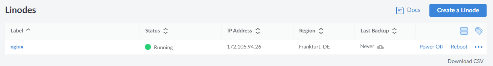
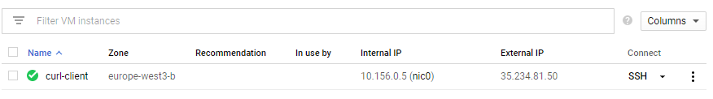

# NGINX through the Syntropy network

This tutorial will show you how to create a basic network on the Syntropy Platform.
It shows how connections can be made using tags (connecting one endpoint
to many). Terraform and Ansible is used to automatically provision the 
infrastructure needed and to automatically deploy the Syntropy Agent and NGINX.

## Requirements

There are some prerequisites to use this example:

* An active Syntropy Stack account
* An active Google Cloud Platform account with billing enabled
* An active Linode Cloud account
* Python >= 3.6
* Terraform and Ansible >= 2.10 installed on your local machine

## Installation

For this example, you will need the Syntropy Stack ansible collection
and its dependencies. To install them run:

```
ansible-galaxy collection install git@github.com:SyntropyNet/syntropy-ansible-collection.git
```

To install the collection's dependencies, navigate into the collection directory
and run:
```
pip3 install -U -r requirements.txt
```

## Variables

In order for Terraform and Ansible to be able to set up everything automatically,
you will need to input a few variables in `infra/terraform.tfvars` and 
`ansible/vars/main.yml`. The examples for these can be found in their respective
`.example` files.

Useful links for generating the variables:

1. [How to generate Linode Personal Access Token](https://www.linode.com/docs/guides/getting-started-with-the-linode-api/)
2. [How to generate Google Cloud Platform service key](https://cloud.google.com/iam/docs/creating-managing-service-account-keys)
3. [How to generate a Syntropy Agent Token](https://docs.syntropystack.com/docs/get-your-agent-token)

## Provisioning infrastructure

After you have filled in your Terraform and Ansible variables, you can start
creating your virtual machines. This is a simple step and only requires two
commands (in the `infra` directory):

```
terraform init
terraform apply
```

## Deploying NGINX and agents using Ansible

After Terraform is done creating the virtual machines on Linode and GCP,
it dynamically generates the Ansible inventory file. That simplifies
the process of gathering the IP addresses manually. In order to finish the
deployment, you need to run the Ansible playbook (in the `ansible` directory):

```
ansible-playbook main.yml -i inventory.yml
```

## Verify that your machines are up and running

The status of the machines should look something like this (Linode and GCP
respectively):




## SSH into the Curl client machine

You can find the Curl virtual machine IP address in the `ansible/inventory.yml`
file. Log into it using the command `ssh curl@<CURL_MACHINE_IP> -i <private_key_file>`.
After that, you can run the command `curl http://<NGINX_DOCKER_IP>` and see
that your requests to the NGINX server are routed through an encrypted Wireguard
tunnel.

## Checkout the network setup on Syntropy Platform

If configured correctly, the network layout should be simple and look like this:

