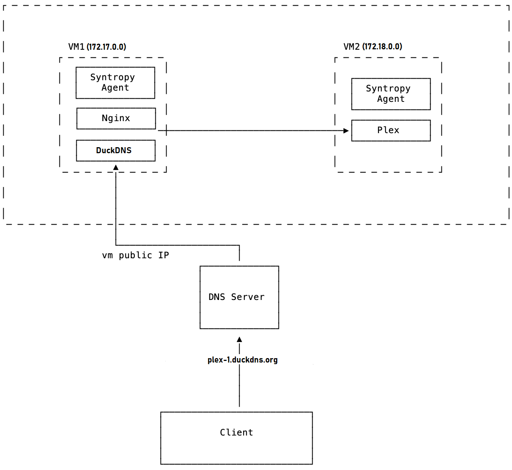
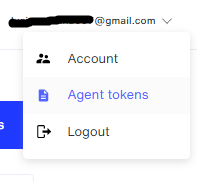
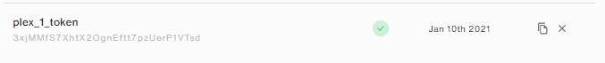
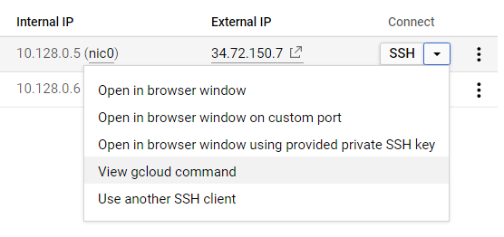
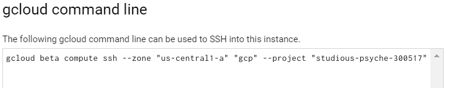
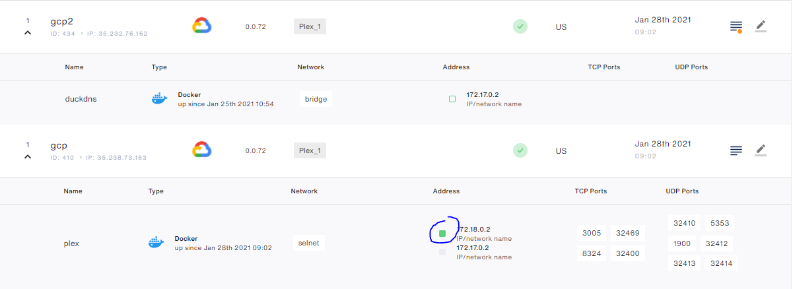
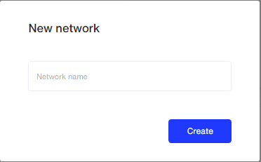
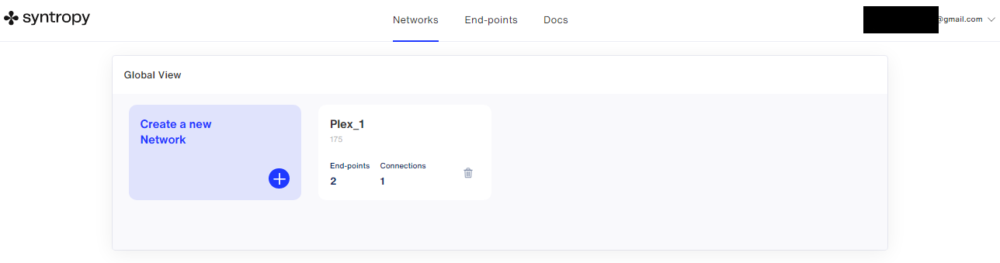
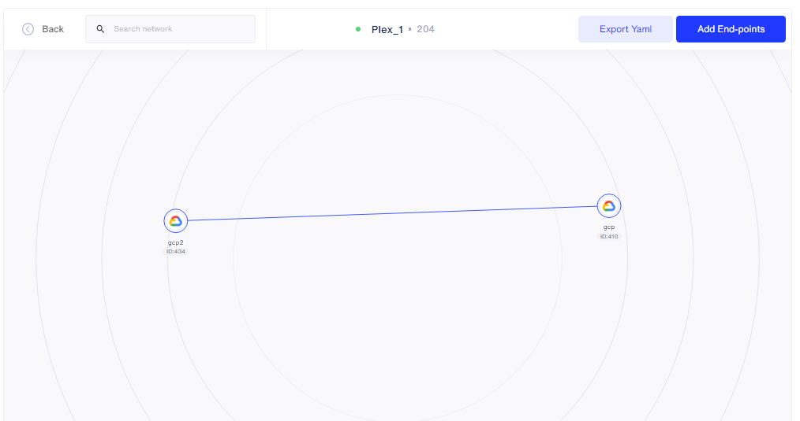
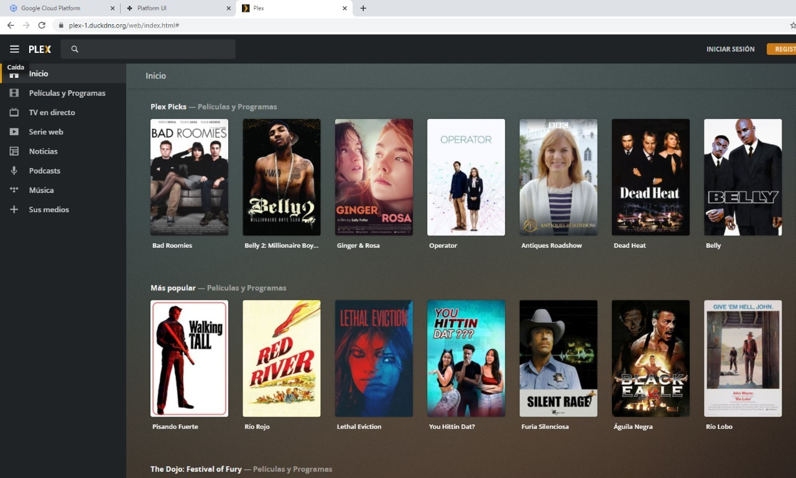

# Syntropy Network to connect to your home PLEX Server

## Objective

Connect to your home PLEX server behind NAT from the internet. 

Create a Syntropy Network with 2 nodes:

- One to run nginx service as a reversed proxy.
- One to run a Plex service.

## Requirements

* There must be no ports exposed to the internet (except Nginx 443 with SSL). You can't use -p flag.
* All services must run in Docker containers.
* All connections between services must be created using Syntropystack.
* After creating a connection, you must be able to connect to your Plex server service from your computer - https://plex.example.com
* You must create a Docker network (name: syntropynet) on each node and assign subnets, which can’t overlap.
* All services must run in syntropynet Docker network.
* For subdomain, you can use DuckDNS - https://hub.docker.com/r/linuxserver/duckdns

## Topology

To achieve the objective, this was the used topology:

## Considerations

- Both VM1 and VM2 were created using Google Cloud Platform.
- VM1 will be referred to as *gcp2* and VM2 will be referred to as *gcp* because those were the assigned names when they were created in Google Cloud Platform.

## Instructions

### 1. Access SyntropyStack Webpage and Create your Agent Token

The corresponding tab can be accessed from a buttom in the upper right part of the interface. Click on your e-mail and then click on Agent Tokens.

In the Agent Tokens tab, create a new Token with your desired expiration date. In this example, it was January 10th, 2021.

You will need that token for next steps.

### 2. Create your Google Cloud VMs

This step is necessary if you want to use a vps for the nodes like I did. But you could do this with any other types of nodes such as two computers (as long as they have different public IPs so they do not collide).

You will need to install wireguard as explained [here](https://www.wireguard.com/install/). As linux OS with a kernel newer than 5.6.0 have native support to wireguard I decided to create virtual machine instances with the newest Ubuntu version:

Once created, they should look like this:

As explained in [Considerations Section](#considerations), **gcp** will run the Plex server and **gcp2** will run nginx service.

### 3. Create an Account in duckdns and get your token

Go to https://duckdns.org, create an account and create a domain for your webpage (plex-1.duckdns.org in this case). Your dashboard should look like this:

You can then write the public ip of your VM1 and right after that whenever you try to access that URL, it will automatically redirect you to VM1's IP. If that public ip is dinamic, you can create a duckdns service to make it change automatically, which is explained in one of the next steps.

### 4. Get your certificates for your webpage

There are different ways to achieve this. I personally used certbot which has a well explained tutorial [here](https://certbot.eff.org/lets-encrypt/ubuntufocal-other). 

After finishing it, you should see a message like this:

You should also have 2 new files:
- privkey.pem
- fullchain.pem

### 4.1 Create a ssl_dhparam file

You can create it with openssl dhparam -out dhparam.pem 4096. Have in mind that is a process that can take several minutes.

### 5. Create an Internal Network for Plex

This step is necessary to avoid internal IP colissions between the docker processes. In VM2 run:

    docker network create --subnet=172.18.0.0/16 selnet

That will create a network called selnet with the ip 172.18.0.0. You could change both the name and ip if you want. 

By default, the network 172.17.0.0 was taken by docker so I added one number to it, to make it 172.18.0.0. But you could use other number if you want. To see what ips are used you can run:
    
    ip r

### 6. Create your nginx configuration file

In VM1 create the nginx.conf file:

    sudo nano nginx.conf

And add the following lines:

    events {}

    http{
        ssl_session_cache shared:SSL:10m;
        ssl_session_timeout 10m;

        upstream plex_backend {
            server plex-docker-ip:32400;
            keepalive 32;
        }
        server {
            listen 80;
            listen 443 ssl;
            listen [::]:443 ssl ipv6only=on; 
            server_name duckdns-url;

            ssl_certificate path/to/fullchain.pem;
            ssl_certificate_key path/to/privkey.pem;
            ssl_dhparam path/to/dhparam.pem;
            ssl_ecdh_curve secp384r1;

            proxy_set_header Host $host;
            proxy_set_header X-Real-IP $remote_addr;

            location / {
                proxy_pass http://plex_backend;
            }
        }
    }

With that, nginx will be configured to redirect the access from VM1 to VM2. Parameters Explanation:
* **plex-docker-ip**: This is the ip of the docker service (in this case 172.18.0.2. It could be different so always run "ip r" to check it).
* **duckdns-url**: The URL you choose from duckdns.org, in this case: plex-1.duckdns.org.

If you want, you can add more lines to the configuration file to make it more optimized to use it with plex. Check the nginx.conf file uploaded in this folder to see all the configuration parameters that I used. But these ones, are the most important ones.

### 7. Log into each node and run all the services

Connect to the VMs using SSH. The easiest way is to use gcloud commands. You can get the specific commands by clicking on the SSH menu, on each instance.

For instance, this is the command to SSH to **gcp** node:

### 7.1 Install Docker

You need to [install docker](https://docs.docker.com/engine/install/ubuntu/) first on each VM.

### 7.2 For VM1:

Run Nginx Service:

    sudo docker run --detach \
    --name nginx \
    --publish 443:443 \
    --volume /etc/nginx/certs \
    --volume /etc/nginx/vhost.d \
    --volume /usr/share/nginx/html \
    --volume /var/run/docker.sock:/tmp/docker.sock:ro \
    --volume /./auth:/etc/nginx/htpasswd \
    --volume /etc/letsencrypt:/etc/letsencrypt/ \
    --network="host"\
    --volume path/to/nginx.conf:/etc/nginx/nginx.conf jwilder/nginx-proxy 

Run Syntropy Service:

    sudo docker run --network="host" --restart=on-failure:10 \
    --cap-add=NET_ADMIN \
    --cap-add=SYS_MODULE -v /var/run/docker.sock:/var/run/docker.sock:ro \
    --device /dev/net/tun:/dev/net/tun --name=syntropy \
    -e SYNTROPY_NETWORK_API='docker' \
    -e SYNTROPY_API_KEY=AGENT_TOKEN -d syntropynet/agent:stable

Run DuckDNS Service:

    sudo docker run -d \
    --name=duckdns \
    -e PUID=1000 \
    -e PGID=1000 \
    -e TZ=us-central1-a \
    -e SUBDOMAINS=plex-1 \
    -e TOKEN=DUCK_DNS_TOKEN \
    --restart unless-stopped \
    linuxserver/duckdns

Remember to replace **AGENT_TOKEN** by the Agent Token that you generated on the UI of SyntropyStack. Also **DUCK_DNS_TOKEN** is the token you copy from duckdns.org.

### 7.3 For VM2:

Run Plex Service with:

    sudo docker run --detach \
    --name=plex \
    --net=selnet \
    -e PUID=1000 \
    -e PGID=1000 \
    -e VERSION=docker \
    -e UMASK_SET=022 `#optional` \
    -v /share/container/plex/config:/config \
    -v /share/container/plex/TV:/tv \
    -v /share/container/plex/Movies:/movies `#optional, you can alter them if you already stored you media files elsewhere, you can also add as many shares as you like` \
    --restart unless-stopped \
    linuxserver/plex:latest

Notice that I'm running plex in network **selnet** which is the one I created in a previous step.

Run the Syntropy Service:

    sudo docker run --network="host" --restart=on-failure:10 \
    --cap-add=NET_ADMIN \
    --cap-add=SYS_MODULE -v /var/run/docker.sock:/var/run/docker.sock:ro \
    --device /dev/net/tun:/dev/net/tun --name=syntropy \
    -e SYNTROPY_NETWORK_API='docker' \
    -e SYNTROPY_API_KEY=AGENT_TOKEN -d syntropynet/agent:stable

Remember to replace **AGENT_TOKEN** by the Agent Token that you generated on the UI of SyntropyStack. 

Notice that the command to run the Syntropy Service is the same in both VM1 and VM2.

### 8. Create the Syntropy Network

Go back to the SyntropyStack webpage, to the EndPoints section and check that you have your two nodes connected. They should look like this:

Mark the green option (the one that is highlighted with a blue circle) so plex service is exposed to the other nodes through the Syntropy Network.

Now go to the Networks tab and click on 'Create a New Network'. Asign your desired name ('Plex_1' for this example) and click on 'Create'.

Access it and add the two endpoints by clicking on 'Add End-Points'. Make the connections by clicking on one of the Nodes and selecting with which you want it to connect.

### 9. Check for Connection Correctness

Go to any of your virtual machines and check if there is a proper connection by running:

    sudo wg show

You should see an output like this. Check for the existance of a HandShake.

### 10. Access Plex from VM1

With all the previous steps completed, you should be able to access your plex server from your VM1.

You can run this command to save the plex webpage.

    wget https://plex-1.duckdns.org/web

Or you can directly access the plex webapp with the web explorer going to

    https://plex-1.duckdns.org

As you can see, it shows as a verified webpage and you are accessing using port 443 (not any internal ip).

**Congratulations, your architecture is up and running.**
