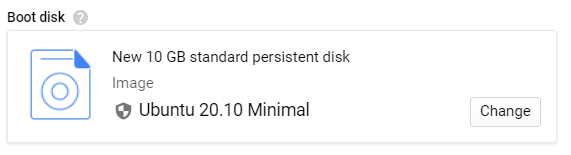
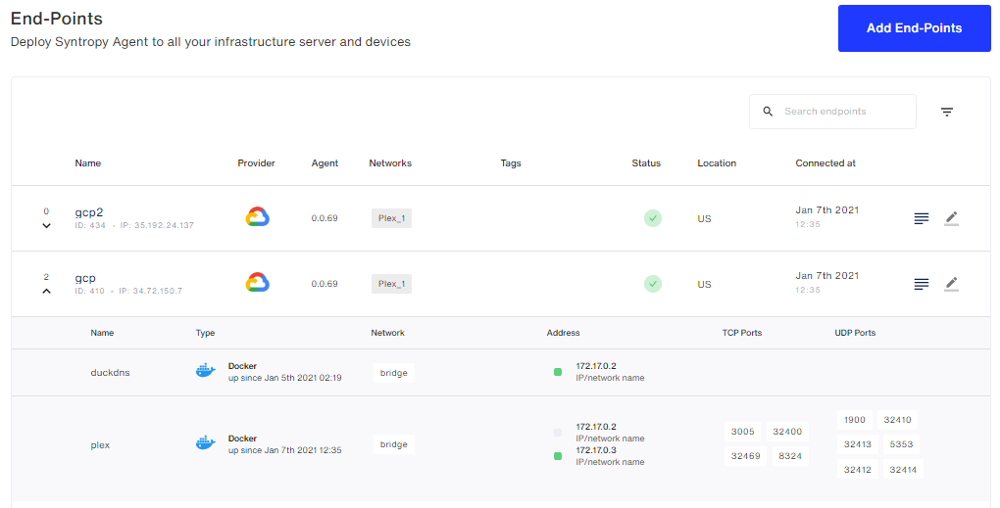
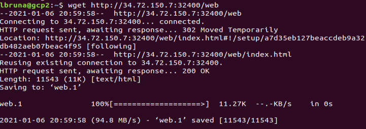
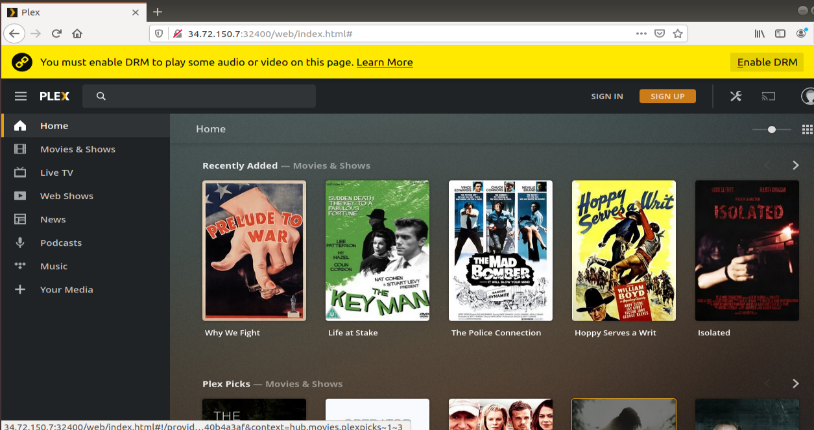

# Syntropy Network to connect to your home PLEX Server

## Objective

Creating a Syntropy Network with 2 nodes:

- One to work as a personal computer (host).
- One to run a Plex service.

## Considerations

- For this example I use two VMs on Google Cloud vps to simulate both nodes. But this can be achieved with any type of nodes, with any OS, as long as they have different IPs.
    * The virtual machine to run the Plex service is called **gcp**.
    * The virtual machine to work as a host is called **gcp2**.
- All used services run in Docker Containers.
- All connections between services are created using **SyntropyStack**.

## Instructions

### 1. Access SyntropyStack Webpage and creat your Agent Token

The corresponding tab can be accessed from a buttom in the upper right part of the interface. Click on your e-mail and then click on Agent Tokens.

In the Agent Tokens tab, create a new Token with your desired expiration date. In this example, it was January 10th, 2021.

You will need that token for next steps.

### 2. Create your Google Cloud VMs

This step is necessary if you want to use a vps for the nodes like I did. But you could do this with any other types of nodes such as two computers (as long as they have different public IPs so they do not collide).

You will need to install wireguard as explained [here](https://www.wireguard.com/install/).As linux OS with a kernel newer than 5.6.0 have native support to wireguard I decided to create virtual machine instances with the newest Ubuntu version:

Once created, they should look like this:

As explained in [Considerations Section](#considerations), **gcp** will run the Plex server and **gcp2** will simulate a personal computer.

### 3. Log into each node and run all the services

Connect SSH to the VMs using SSH. The easiest way is to use gcloud commands. You can get the specific commands by clicking on the SSH menu, on each instance.

For instance, this is the command to SSH to **gcp** node:

### 3.1 Install Docker

You need to [install docker](https://docs.docker.com/engine/install/ubuntu/) first on each VM.

### 3.2 For the Server VM:

Run Plex Service with:

    sudo docker run -d \
	--name=plex \
	--net=bridge \
	-e PUID=1000 \
	-e PGID=1000 \
	-e VERSION=docker \
	-e UMASK_SET=022 `#optional` \
	-e PLEX_CLAIM=claim-xvFn_JYqrwWtyTqotN2M `#Get your token from https://www.plex.tv/claim/ it is only valid for a few minutes` \
	-v /share/container/plex/config:/config \
	-v /share/container/plex/TV:/tv \
	-v /share/container/plex/Movies:/movies `#optional, you can alter them if you already stored you media files elsewhere, you can also add as many shares as you like` \
	--restart unless-stopped \
	-p 32400:32400 \
    linuxserver/plex:latest

Run Syntropy Service:

    sudo docker run --network="host" --restart=on-failure:10 \
    --cap-add=NET_ADMIN \
    --cap-add=SYS_MODULE -v /var/run/docker.sock:/var/run/docker.sock:ro \
    --device /dev/net/tun:/dev/net/tun --name=syntropy \
    -e SYNTROPY_NETWORK_API='docker' \
    -e SYNTROPY_API_KEY=AGENT_TOKEN -d syntropynet/agent:stable

You can also run a DuckDNS service for a subdomain:

    docker run -d \
    --name=duckdns \
    -e PUID=1000 `#optional` \
    -e PGID=1000 `#optional` \
    -e TZ=Europe/London \
    -e SUBDOMAINS=subdomain1,subdomain2 \
    -e TOKEN=AGENT_TOKEN \
    -e LOG_FILE=false `#optional` \
    -v /path/to/appdata/config:/config `#optional` \
    --restart unless-stopped \
    ghcr.io/linuxserver/duckdns

Remember to replace **AGENT_TOKEN** by the Agent Token that you generated on the UI of SyntropyStack.

### 3.3 For the Host VM:

Run the Syntropy Service:

    sudo docker run --network="host" --restart=on-failure:10 \
    --cap-add=NET_ADMIN \
    --cap-add=SYS_MODULE -v /var/run/docker.sock:/var/run/docker.sock:ro \
    --device /dev/net/tun:/dev/net/tun --name=syntropy \
    -e SYNTROPY_NETWORK_API='docker' \
    -e SYNTROPY_API_KEY=AGENT_TOKEN -d syntropynet/agent:stable

Remember to replace **AGENT_TOKEN** by the Agent Token that you generated on the UI of SyntropyStack.

### 4. Create the Syntropy Network

Go back to the SyntropyStack webpage, to the EndPoints section and check that you have your two nodes connected. They should look like this:

Now go to the Networks tab and click on 'Create a New Network'. Asign your desired name ('Plex_1' for this example) and click on 'Create'.

Access it and add the two endpoints by clicking on 'Add End-Points'. Make the connections by clicking on one of the Nodes and selecting with which you want it to connect.

### 5. Check for Connection Correctness

Go to any of your virtual machines and check if there is a proper connection by running:

    sudo wg show

You should see an output like this. Check for the existance of a HandShake.

### 6. Access Plex from the Host VM

With all the previous steps completed, you should be able to access your plex server from your Host VM.

You can run this command to save the plex webpage.

    wget http://public_ip_of_server_vm:32400/web

Or you can directly access the plex webapp with the web explorer going to

    ip_of_server_vm:32400/web

Congratulations, your architecture is up and running.
