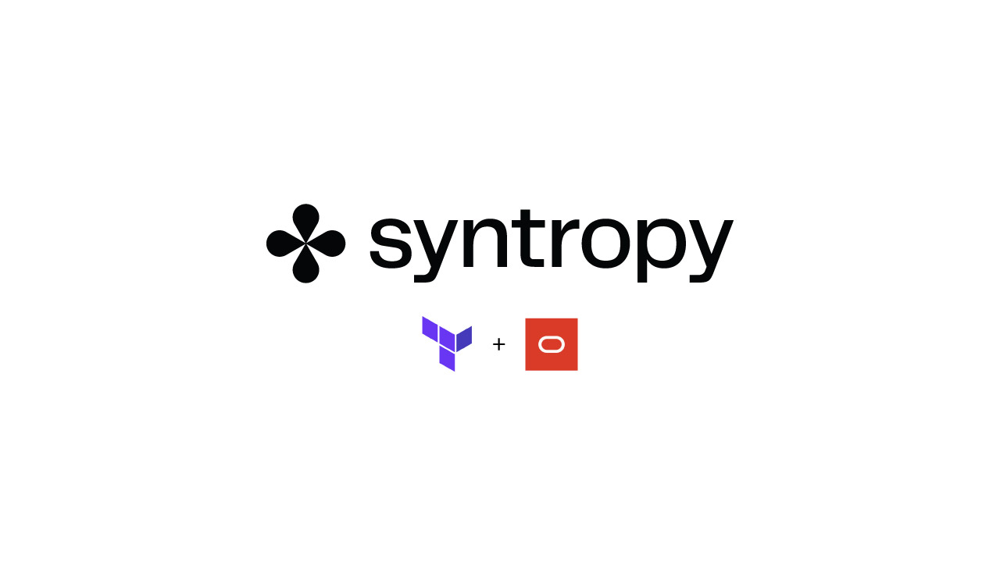
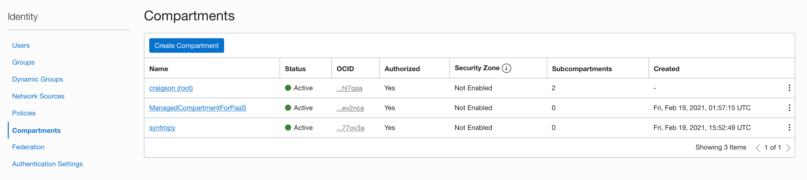
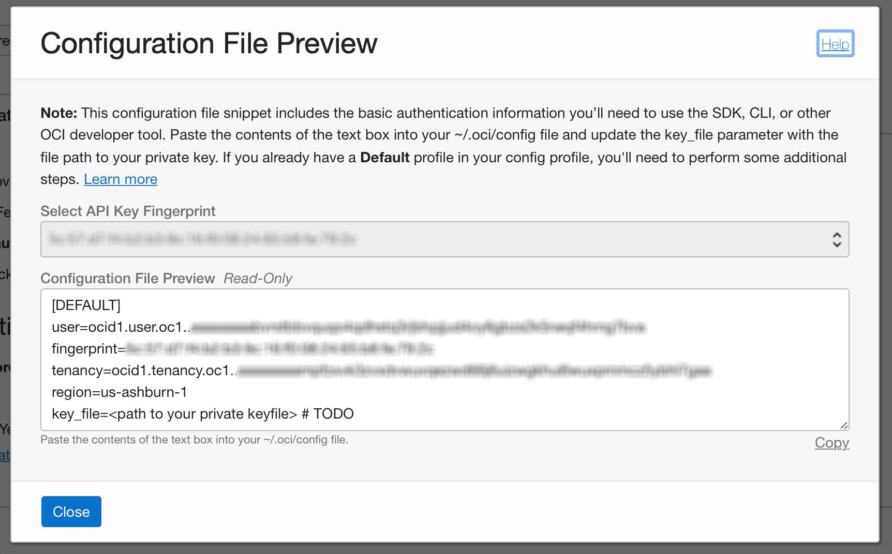
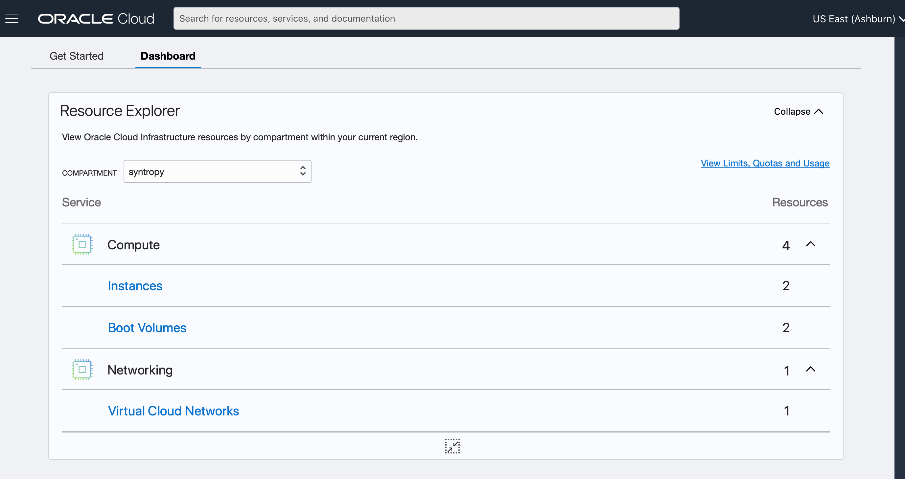

# Provision Oracle Cloud Infrastructure (OCI) using Terraform

This integration showcases how to deploy _n_ instances (Virtual Machines) on OCI using Terraform.

# Requirements

- Oracle Cloud Account
- Terraform installed on your local machine

## Steps for creating infrastructure

1. Rename `terraform/terraform.tfstate.sample` to `terraform/terraform.tfvars`

2. Generate a project-specific SSH key and give it a name that's easily identifiable, eg. `~/.ssh/oracle_rsa`.

```
ssh-keygen -t rsa -b 4096 -C "user@host" -q -N ""
```

Set the `ssh_public_key` and the `ssh_private_key` in the `terraform/terraform.tfvars` file.

```
ssh_public_key    = "~/.ssh/oracle_rsa.pub"
ssh_private_key   = "~/.ssh/oracle_rsa"
```

3. Create a compartment by logging into your Oracle Cloud account and navigating to `Identity > Compartments` and click `Create Compartment`.

.

Give your Compartment a suitable name, eg `syntropy` and set the `Parent Compartment` to `<your_oci_user>(root)`.

Once the Compartment has been created, click on it to access the Compartment details. Click the `copy` option located next to the `OCID` property to copy it to your clipboard. Paste it into your `.tfvars` file.

```
compartment_ocid  = "ocid1.compartment.oc1..xxxxxxxxxxxxxxxx"
```

4. Generate an API key-pair. Navigate to `Identity > Users > User Details` and Under the `Resources` section at the bottom of the page. Select `API Keys` and click the `Add API Key` Button.

Select the `Generate API Key Pair` radio button and click `Download Private Key`.

Next, click the `Add Button` located at the bottom-left corner of the modal. A preview of your configuration will appear.



Copy the values (not the keys as they do not match the terraform config exactly) and place them in your `.tfvars` file.

```
region            = "us-ashburn-1"
tenancy_ocid      = "ocid1.tenancy.oc1..xxxxxxxxxxxxxxxx"
user_ocid         = "ocid1.user.oc1..xxxxxxxxxxxxxxxx"
compartment_ocid  = "ocid1.compartment.oc1..xxxxxxxxxxxxxxxx"
fingerprint        = "84:29:X:X:X:X:X:e4:3b"
```

Next, move the private key file from your downloads folder to your `~/.oci` directory.

```
mkdir ~/.oci
cd ~/Downloads
mv <your_pvt_key>.pem ~/.oci/oracle.pem
```

Add the private keys location to your `.tfvars file`.

```
private_key_path  = "~/.oci/oracle.pem"
```

**Important Note:** Should you wish to change the region, OCI uses different Shape Images for different regions, you can find the list of Images per-region for Ubuntu 20.04 LTS [here](https://docs.oracle.com/en-us/iaas/images/ubuntu-2004/). You will need to add your region to the `instance_image_ocid` map.

5. Initialize the Terraform working directory.

```
cd terraform
terraform init
```

6. Create an execution plan to confirm there are no errors in your template.

```
terraform plan
```

7. Apply the executaion plan - you will need to enter a value of `yes` to confirm this action when prompted to do so.

```
terraform apply
```

When the execution plan is complete, you should see a summary showing that it was successful.

```
Apply complete! Resources: 6 added, 0 changed, 0 destroyed.
```

8. Inspect your resources in the Oracle Cloud UI dashboard.



You can SSH into your instance using the `ubuntu` user.

```
ssh -i ~/.ssh/oracle_rsa ubuntu@<instance_public_ip>
```
